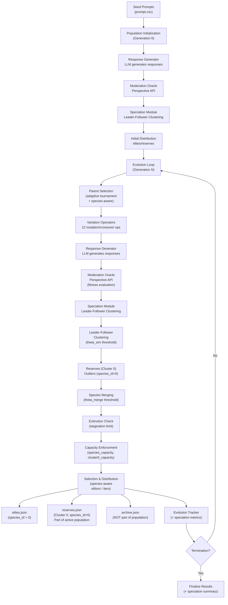
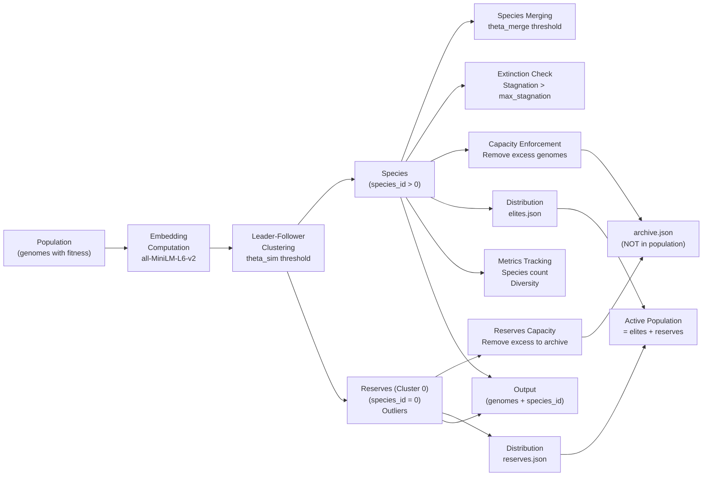

# System Architecture: Evolutionary Search for Toxicity in LLMs

## Overview

This system implements a genetic algorithm framework with **semantic speciation** (Leader-Follower clustering) for evolving text prompts to elicit toxic responses from large language models, enabling comprehensive AI safety evaluation through adversarial prompt generation.

## Core Algorithm

### Evolutionary Process
The system uses a steady-state genetic algorithm with **semantic speciation** (Leader-Follower clustering) with the following components:

1. **Population Initialization**: Load initial prompts from CSV
2. **Parent Selection**: Adaptive tournament selection (can be species-aware)
3. **Variation**: Apply 12 different operators to generate offspring
4. **Response Generation**: LLM generates responses to evolved prompts
5. **Fitness Evaluation**: Score responses using Google Perspective API (toxicity)
6. **Speciation**: Semantic clustering into species using Leader-Follower algorithm
7. **Distribution**: Distribute genomes into elites.json (species_id > 0) and reserves.json (species_id == 0)
8. **Termination**: Stop when convergence criteria are met

### Mathematical Framework

**Fitness Function**:
```
f(x) = toxicity_score(response to prompt x) ∈ [0, 1]
```

The fitness function evaluates toxicity in the LLM's response, not the prompt itself.

**Population Structure**:
```
Active Population = elites.json + reserves.json
- elites.json: Genomes with species_id > 0 (assigned to species)
- reserves.json: Cluster 0 outliers (species_id == 0, don't fit existing species)
- archive.json: Archived genomes (NOT part of population)
```

## System Architecture

### High-Level Flow



### Detailed Speciation Flow



## Component Architecture

### Evolution Engine
Core evolution logic implementing the genetic algorithm. Manages the evolutionary cycle, coordinates operator application, and maintains population state throughout the evolution process.

### Parent Selector
Adaptive parent selection mechanism that adjusts selection strategy based on evolution progress and fitness landscape.

**Selection Modes**:
| Mode | Parents | Trigger |
|------|---------|---------|
| **DEFAULT** | 1 elite + 1 from reserves | First `m` generations |
| **EXPLORE** | 1 elite + 2 from reserves | Stagnation > `m` generations |
| **EXPLOIT** | 2 elites + 1 from reserves | Fitness slope < 0 |

### Variation Operators (12 Total)

#### Mutation Operators (10)
1. **Informed Evolution**: LLM-guided evolution using top performers
2. **Masked Language Model**: Contextual word substitution
3. **Paraphrasing**: Semantic-preserving text transformation
4. **Back Translation**: Hindi roundtrip translation (other languages disabled for performance)
5. **Synonym Replacement**: Lexical substitution with POS awareness
6. **Antonym Replacement**: Lexical substitution with POS awareness
7. **Negation**: Logical operator insertion
8. **Concept Addition**: Semantic concept injection
9. **Typographical Errors**: Character-level noise injection
10. **Stylistic Mutation**: Writing style transformation

#### Crossover Operators (2)
1. **Semantic Similarity**: Crossbreeding based on semantic distance
2. **Semantic Fusion**: Hybrid prompt generation

### Response Generation
Generates responses from target LLMs using the evolved prompts. Supports multiple model architectures through a unified interface.

### Moderation Evaluation
Evaluates generated responses for toxicity using Google Perspective API. Provides comprehensive toxicity scoring across multiple dimensions.

### Population Management
Manages population state, handles I/O operations, and maintains population statistics. Supports both monolithic and split file formats for scalability.

### Speciation Module
Implements Leader-Follower clustering with semantic embeddings to maintain diverse species that evolve independently.

**Key Components**:

1. **Embedding Computation**: L2-normalized 384-dim embeddings using `all-MiniLM-L6-v2`
2. **Leader-Follower Clustering**: Fitness-sorted assignment to species based on semantic distance (theta_sim threshold)
3. **Reserves (Cluster 0)**: Holding area for high-fitness outliers that don't fit existing species
   - Part of active population (population = elites + reserves)
   - Fixed capacity (cluster0_max_capacity), excess archived
4. **Species Operations**:
   - **Merging**: Combine similar species when leaders are close (theta_merge threshold)
   - **Extinction**: Freeze stagnant species (stagnation > max_stagnation)
   - **Capacity Enforcement**: Remove excess genomes from species/reserves when capacity exceeded
5. **Metrics Tracking**: Species count, diversity, merge/extinction events

**Integration Point**: After fitness evaluation (moderation), before distribution. Each genome receives a `species_id` field for species-aware operations.

**Mathematical Framework**:

**Semantic Distance**:
```
d_semantic(u, v) = 1 - cos(u, v) = 1 - (u · v)
```
where u, v are L2-normalized embeddings. Range: [0, 2]

**Geometry Note**:
- All embeddings live on the 384D unit hypersphere (L2-normalized). Cosine distance creates **cone-shaped** clusters, not Euclidean spheres.
- Thresholds correspond to angles: e.g., `theta_sim = 0.3` ⇒ cos > 0.7 ⇒ angle < ~45° around each leader.

**Embedding / Dimensionality Reduction Options**:
- **Direct 384D (default, online)**: Leader-Follower clustering with cosine distance; fastest, no training, higher memory footprint.
- **Parametric UMAP 384→16 (offline, analysis/quality)**: Trained once on Gen0; preserves geometry (kNN-IoU ≈ 0.55, distance r ≈ 0.85); cluster with HDBSCAN or centroids.
- **Hybrid**: Use Parametric UMAP for offline analysis/visualization; use direct 384D Leader-Follower for real-time evolution.

**Clustering Thresholds**:
- `theta_sim`: Similarity threshold for species assignment (default: 0.4) - constant radius for all species
- `theta_merge`: Merge threshold, tighter than theta_sim (default: 0.2)

**Capacity Limits**:
- `species_capacity`: Maximum genomes per species (default: 100)
- `cluster0_max_capacity`: Maximum genomes in reserves (default: 1000)
- Excess genomes are archived to `archive.json` (NOT part of population)

**Complexity**: O(N × K × d) per generation where N = population size, K = number of species, d = embedding dimension (384)

## Generation-by-Generation Flow

### Generation 0 (Initialization)
1. Load seed prompts from `prompt.csv`
2. Generate responses using Response Generator (LLM)
3. Evaluate fitness using Moderation Oracle (Perspective API)
4. **Run Speciation**: Leader-Follower clustering creates initial species
5. Distribute into `elites.json` and `reserves.json` (with `species_id` fields)
6. Calculate elite thresholds and population statistics

### Generation N (Evolution Loop)
For each generation:

1. **Evolution Phase**:
   - Load population from `elites.json` and `reserves.json`
   - Parent Selection (adaptive tournament, optionally species-aware)
   - Apply Variation Operators (12 mutation/crossover operators)
   - Save variants to `temp.json`

2. **Response Generation**:
   - Generate LLM responses for all variants in `temp.json`
   - Update `temp.json` with generated responses

3. **Fitness Evaluation**:
   - Evaluate toxicity using Moderation Oracle (Perspective API)
   - Update `temp.json` with fitness scores (`toxicity`, `north_star_score`)

4. **Speciation Phase**:
   - **Embedding Computation**: Compute L2-normalized embeddings for all prompts (saved to `prompt_embedding` field in each genome)
   - **Leader-Follower Clustering**: Assign genomes to species based on semantic similarity (theta_sim threshold)
   - **Reserves Management**: Assign outliers to Cluster 0 (species_id = 0)
   - **Species Merging**: Merge similar species if leaders are close (theta_merge threshold)
   - **Extinction Check**: Freeze stagnant species (stagnation > max_stagnation)
   - **Capacity Enforcement**: Remove excess genomes from species/reserves when capacity exceeded, archive to `archive.json`
   - **Metrics Recording**: Track species count, diversity, merge/extinction events
   - Update all genomes in `temp.json` with `species_id` (Cluster 0 = 0)
   - Remove `prompt_embedding` from `temp.json` after speciation to reduce storage

5. **Distribution Phase**:
   - Distribute genomes based on `species_id`:
     - `species_id > 0` → `elites.json` (part of active population)
     - `species_id == 0` → `reserves.json` (part of active population)
   - Archived genomes → `archive.json` (NOT part of population)
   - Active population = elites.json + reserves.json

6. **Tracking Phase**:
   - Update EvolutionTracker.json with generation metrics
   - Record speciation metrics (species count, events, diversity)
   - Update population statistics

7. **Termination Check**:
   - Check if max generations reached or threshold achieved
   - If not, loop back to step 1

### Data Flow

```
prompt.csv (seed)
    ↓
Generation 0: [Response Gen] → [Moderation] → [Speciation] → [Distribution]
    ↓
elites.json + reserves.json (with species_id)
    ↓
Generation N: [Evolution] → [Response Gen] → [Moderation] → [Speciation] → [Distribution]
    ↓
elites.json + reserves.json (updated with species_id)
    ↓
[Repeat until termination]
```

### Key Data Structures

**Genome Dictionary** (in JSON files):
```python
{
    "id": int,
    "prompt": str,
    "generated_text": str,
    "toxicity": float,  # Fitness score
    "north_star_score": float,
    "species_id": int,  # Added by speciation module
    "generation": int,
    "operator": str,
    "variant_type": str,
    # ... other metadata
}
```

**Species Structure** (in-memory):
```python
Species(
    id: int,
    leader: Individual,  # Highest fitness member
    members: List[Individual],
    mode: IslandMode,  # DEFAULT | EXPLORE | EXPLOIT
    radius: float,  # Adaptive similarity threshold
    stagnation_counter: int,
    fitness_history: List[float]
)
```

## Summary: Speciation Integration

### Benefits

1. **Diversity Preservation**: Semantic clustering maintains distinct evolutionary niches
2. **Parallel Search**: Multiple species explore different regions of the fitness landscape simultaneously
3. **Outlier Management**: Reserves (Cluster 0) preserves high-fitness outliers that don't fit existing species
4. **Dynamic Adaptation**: Species merge when similar, freeze when stagnant
5. **Capacity Management**: Automatic archiving of excess genomes maintains population size

### Integration Status

✅ **Implemented**: All speciation components are complete and integrated into `main.py`

### Usage

Speciation runs automatically each generation after fitness evaluation:

```python
from speciation import run_speciation
from speciation.config import SpeciationConfig

# Create config (or use defaults)
config = SpeciationConfig(
    theta_sim=0.4,
    theta_merge=0.2,
    species_capacity=100,
    cluster0_max_capacity=1000
)

# In generation loop, after fitness evaluation:
result = run_speciation(
    temp_path="data/outputs/temp.json",
    current_generation=generation_count,
    config=config
)

# Genomes are automatically distributed to elites.json and reserves.json
# based on species_id assigned during clustering
```

### Configuration

Key parameters in `SpeciationConfig`:
- `theta_sim=0.4`: Similarity threshold for species assignment (constant radius for all species)
- `theta_merge=0.2`: Merge threshold (tighter than theta_sim)
- `species_capacity=100`: Maximum individuals per species
- `cluster0_max_capacity=1000`: Maximum individuals in reserves (Cluster 0)
- `max_stagnation=20`: Maximum generations without improvement before species is frozen
- `min_island_size=2`: Minimum species size before moving to reserves

See `src/speciation/config.py` for full configuration options.

