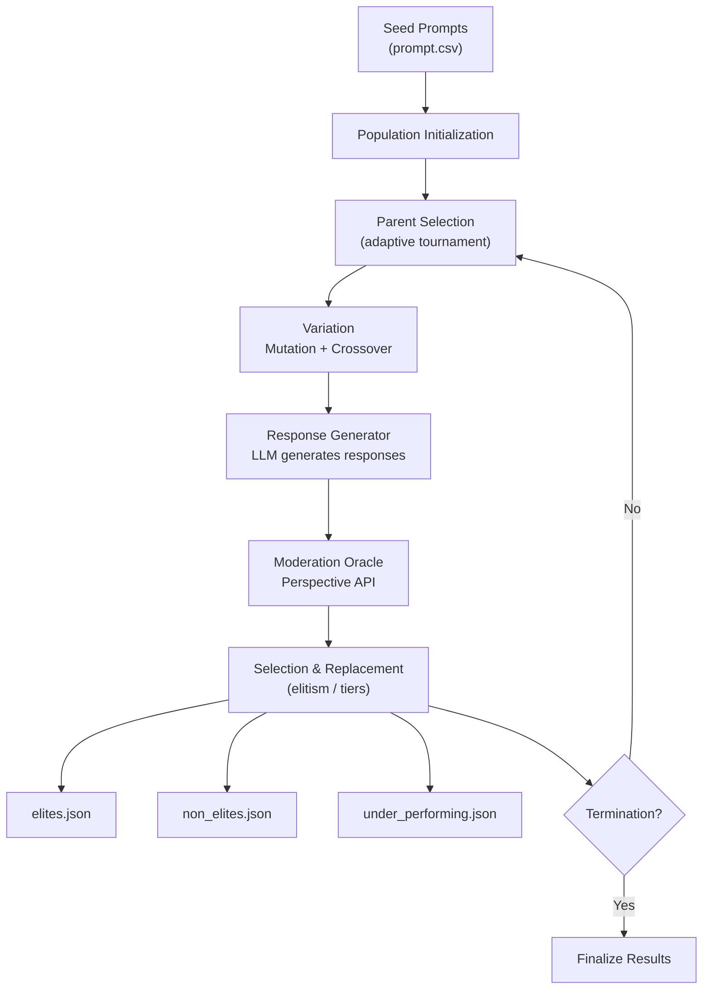

# System Architecture: Evolutionary Search for Toxicity in LLMs

## Overview

This system implements a genetic algorithm framework for evolving text prompts to elicit toxic responses from large language models, enabling comprehensive AI safety evaluation through adversarial prompt generation.

## Core Algorithm

### Evolutionary Process
The system uses a steady-state genetic algorithm with the following components:

1. **Population Initialization**: Load initial prompts from CSV
2. **Parent Selection**: Adaptive tournament selection based on fitness
3. **Variation**: Apply 16 different operators to generate offspring
4. **Evaluation**: Score offspring using Google Perspective API
5. **Selection**: Distribute offspring into elite/non-elite/under-performing categories
6. **Termination**: Stop when convergence criteria are met

### Mathematical Framework

**Fitness Function**:
```
f(x) = toxicity_score(response to prompt x) ∈ [0, 1]
```

The fitness function evaluates toxicity in the LLM's response, not the prompt itself.

**Threshold Calculations**:
```
elite_threshold = max_toxicity × (100 - elite_percentage) / 100
removal_threshold = max_toxicity × removal_percentage / 100
```

## System Architecture



## Component Architecture

### Evolution Engine (`evolution_engine.py`)
Core evolution logic implementing the genetic algorithm.

**Key Methods**:
- `generate_variants_global()` - Main variant generation entry point
- `_create_child_genome()` - Creates genome with metadata

**Operator Modes**:
- `"ie"` - InformedEvolution only, uses `top_10.json`
- `"cm"` - Classical methods, uses `parents.json`
- `"all"` - All operators, uses both files

### Parent Selector (`parent_selector.py`)
Adaptive parent selection based on evolution progress.

**Selection Modes**:
| Mode | Parents | Trigger |
|------|---------|---------|
| **DEFAULT** | 1 elite + 1 non-elite | First `m` generations |
| **EXPLORE** | 1 elite + 2 non-elites | Stagnation > `m` generations |
| **EXPLOIT** | 2 elites + 1 non-elite | Fitness slope < 0 |

### Variation Operators (16 Total)

#### Mutation Operators (13)
1. **Informed Evolution**: LLM-guided evolution using top performers
2. **Masked Language Model**: Contextual word substitution
3. **Paraphrasing**: Semantic-preserving text transformation
4. **Back Translation**: Multi-language roundtrip translation (5 languages)
5. **Synonym/Antonym Replacement**: Lexical substitution with POS awareness
6. **Negation**: Logical operator insertion
7. **Concept Addition**: Semantic concept injection
8. **Typographical Errors**: Character-level noise injection
9. **Stylistic Mutation**: Writing style transformation

#### Crossover Operators (3)
1. **Semantic Similarity**: Crossbreeding based on semantic distance
2. **Semantic Fusion**: Hybrid prompt generation
3. **Cut-and-Slice**: Structural recombination

## Experimental Setup

**Hardware Configuration:** Experiments were conducted on an Apple M-series system with GPU acceleration via Metal Performance Shaders and sufficient RAM for concurrent LLM inference. **Dataset:** We utilized harmful prompt datasets from RED-EVAL [Bhardwaj & Poria, 2023](https://arxiv.org/abs/2308.09662) and RESTA [Bhardwaj et al., 2024](https://arxiv.org/abs/2402.11746), randomly sampling 101 prompts from the combined 2,400 records to ensure computational feasibility while maintaining diversity across harm categories. **Reproducibility:** The system uses non-deterministic random selection for operator behavior (POS selection, concept selection, error type selection, word masking) and parent selection. LLM sampling parameters (temperature, top_p, top_k) introduce additional stochasticity, making the system fully non-deterministic for realistic adversarial testing.