# System Architecture: Evolutionary Search for Toxicity in LLMs

## Overview

This system implements a genetic algorithm framework with **semantic speciation** (Leader-Follower clustering) for evolving text prompts to elicit toxic responses from large language models, enabling comprehensive AI safety evaluation through adversarial prompt generation.

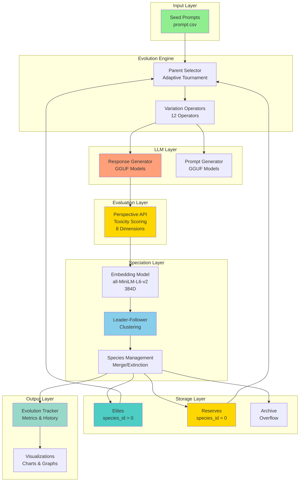


*Figure 1: Speciation dashboard showing species evolution, diversity metrics, and fitness progression over generations.*

## Core Algorithm

### Evolutionary Process

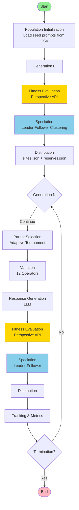

The system uses a steady-state genetic algorithm with **semantic speciation** (Leader-Follower clustering) with the following components:

1. **Population Initialization**: Load initial prompts from CSV
2. **Parent Selection**: Adaptive tournament selection (species-aware)
3. **Variation**: Apply 12 different operators to generate offspring
4. **Response Generation**: LLM generates responses to evolved prompts
5. **Fitness Evaluation**: Score responses using Google Perspective API (toxicity)
6. **Speciation**: Semantic clustering into species using Leader-Follower algorithm
7. **Distribution**: Distribute genomes into elites.json (species_id > 0) and reserves.json (species_id == 0)
8. **Termination**: Stop when convergence criteria are met

### Mathematical Framework

**Fitness Function**: `f(x) = toxicity_score(LLM(x)) ∈ [0, 1]` where `x` is a prompt and `LLM(x)` is the model's response. The fitness function evaluates toxicity in the LLM's response, not the prompt itself.

**Population Structure**: `P = E ∪ R`, `|P| = |E| + |R|` where:
- `P` = Active population
- `E` = Elites (genomes with `species_id > 0`)
- `R` = Reserves (Cluster 0, `species_id = 0`)
- `A` = Archive (NOT part of population, capacity overflow)

**Population Constraints**:
- `|E| = Σᵢ |Sᵢ|` where `Sᵢ` are species
- `|R| <= C_reserves`
- `|Sᵢ| <= C_species` for all `i`

## Component Architecture

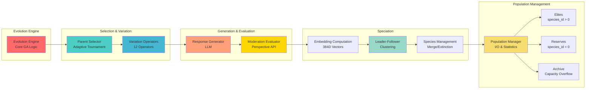

### Evolution Engine
Core evolution logic implementing the genetic algorithm. Manages the evolutionary cycle, coordinates operator application, and maintains population state throughout the evolution process.

### Parent Selector
Adaptive parent selection mechanism that adjusts selection strategy based on evolution progress and fitness landscape. Species are sorted by best_fitness in descending order.

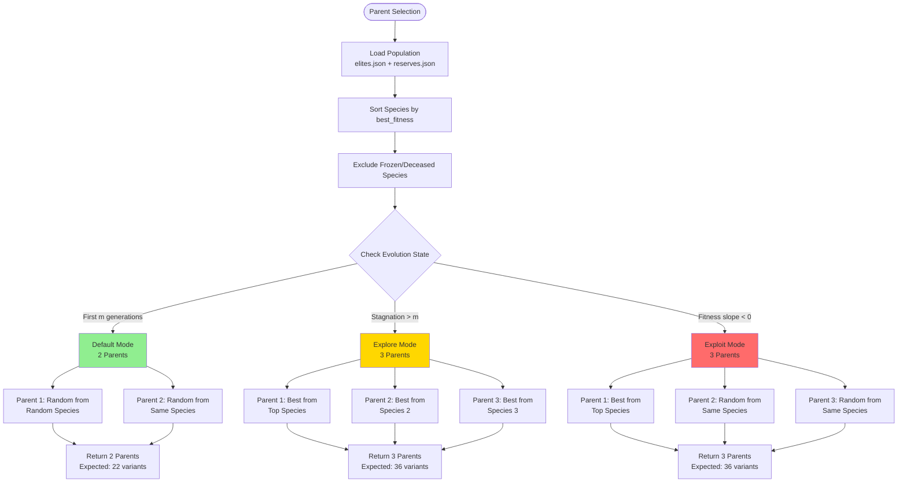

**Selection Modes** (matching ToxSearch variant generation rates):

1. **DEFAULT Mode** (2 parents):
   - Randomly select 1 species, then randomly select 2 genomes from that species
   - Expected variants: `V = (10 × 2 × 1) + (2 × 1 × 1) = 22`

2. **EXPLOITATION Mode** (3 parents from same species):
   - Select top species (highest fitness)
   - Parent 1: Highest fitness genome from top species
   - Parent 2: Random genome from same top species (excluding parent 1)
   - Parent 3: Random genome from same top species (excluding parent 1 and 2)
   - Expected variants: `V = (10 × 3 × 1) + (2 × 3 × 1) = 36`
   - **Purpose**: Intensive local search around best region

3. **EXPLORATION Mode** (3 parents from 3 different species):
   - Parent 1: Highest fitness genome from top species
   - Parent 2: Highest fitness genome from random species 2 (different from top)
   - Parent 3: Highest fitness genome from random species 3 (different from top and species 2)
   - Expected variants: `V = (10 × 3 × 1) + (2 × 3 × 1) = 36`
   - **Purpose**: Maximum diversity, better coverage of fitness landscape

**Variant Count Formula**:
```
V = Σ_{op∈mutations} (|parents| × max_variants) + Σ_{op∈crossovers} (C(|parents|,2) × max_variants)
```

Where:
- `N_mutation = 10` (mutation operators)
- `N_crossover = 2` (crossover operators)
- `max_variants = 1` (variants per operator per parent/pair)
- `C(n,2) = n × (n-1) / 2` (number of parent pairs)

**Mathematical Validation**:

For **DEFAULT mode** (2 parents):
- Mutation variants: `10 × 2 × 1 = 20`
- Crossover variants: `2 × C(2,2) × 1 = 2 × 1 × 1 = 2`
- **Total: 22 variants** ✓

For **EXPLORATION/EXPLOITATION mode** (3 parents):
- Mutation variants: `10 × 3 × 1 = 30`
- Crossover variants: `2 × C(3,2) × 1 = 2 × 3 × 1 = 6`
- **Total: 36 variants** ✓

**Previous Selection Modes** (deprecated):

| Mode | Parent 1 | Parent 2 | Trigger |
|------|----------|----------|---------|
| **DEFAULT** | `p₁ ~ U(S_random)` | `p₂ ~ U(S_p₁)` | `g ≤ m` |
| **EXPLORE** | `p₁ = argmax_{x∈S_top} f(x)` | `p₂ = argmax_{x∈S_j, j≠top} f(x)` | `stagnation > m` |
| **EXPLOIT** | `p₁ = argmax_{x∈S_top} f(x)` | `p₂ ~ U(S_p₁)` | `Δf/Δg < 0` |

where:
- `U(S)` = uniform random selection from species `S`
- `S_top` = species with highest `best_fitness`
- `g` = current generation
- `m` = mode switch threshold
- `f(x)` = fitness of genome `x`
- `Δf/Δg` = fitness slope

**Notes**:
- Frozen/deceased species are excluded from selection: `S_active = {Sᵢ : state(Sᵢ) = "active"}`
- Cluster 0 (reserves) is included in the selection pool
- Species are sorted by `best_fitness` before selection: `S_sorted = sort(S_active, key=best_fitness, reverse=True)`

### Variation Operators (12 Total)

```mermaid
graph TB
    subgraph "Mutation Operators (10)"
        IE[Informed Evolution<br/>LLM-guided]
        MLM[Masked Language Model<br/>Contextual substitution]
        PARA[Paraphrasing<br/>Semantic-preserving]
        BT[Back Translation<br/>Hindi roundtrip]
        SYN[Synonym Replacement<br/>POS-aware]
        ANT[Antonym Replacement<br/>POS-aware]
        NEG[Negation<br/>Logical insertion]
        CON[Concept Addition<br/>Semantic injection]
        TYP[Typographical Errors<br/>Character noise]
        STY[Stylistic Mutation<br/>Style transformation]
    end
    
    subgraph "Crossover Operators (2)"
        SSC[Semantic Similarity<br/>Distance-based]
        SFC[Semantic Fusion<br/>Hybrid generation]
    end
    
    Parents[Parent Prompts] --> IE
    Parents --> MLM
    Parents --> PARA
    Parents --> BT
    Parents --> SYN
    Parents --> ANT
    Parents --> NEG
    Parents --> CON
    Parents --> TYP
    Parents --> STY
    Parents --> SSC
    Parents --> SFC
    
    IE --> Variants[Generated Variants]
    MLM --> Variants
    PARA --> Variants
    BT --> Variants
    SYN --> Variants
    ANT --> Variants
    NEG --> Variants
    CON --> Variants
    TYP --> Variants
    STY --> Variants
    SSC --> Variants
    SFC --> Variants
    
    style IE fill:#FF6B6B
    style SSC fill:#4ECDC4
    style SFC fill:#4ECDC4
```

#### Mutation Operators (10)
1. **Informed Evolution**: LLM-guided evolution using top performers
2. **Masked Language Model**: Contextual word substitution
3. **Paraphrasing**: Semantic-preserving text transformation
4. **Back Translation**: Hindi roundtrip translation (other languages disabled for performance)
5. **Synonym Replacement**: Lexical substitution with POS awareness
6. **Antonym Replacement**: Lexical substitution with POS awareness
7. **Negation**: Logical operator insertion
8. **Concept Addition**: Semantic concept injection
9. **Typographical Errors**: Character-level noise injection
10. **Stylistic Mutation**: Writing style transformation

#### Crossover Operators (2)
1. **Semantic Similarity**: Crossbreeding based on semantic distance
2. **Semantic Fusion**: Hybrid prompt generation

### Response Generation
Generates responses from target LLMs using the evolved prompts. Supports multiple model architectures through a unified interface using llama-cpp-python.

### Moderation Evaluation
Evaluates generated responses for toxicity using Google Perspective API. Provides comprehensive toxicity scoring across 8 dimensions:
- TOXICITY, SEVERE_TOXICITY, IDENTITY_ATTACK, INSULT, PROFANITY, THREAT, SEXUALLY_EXPLICIT, FLIRTATION

**Error Handling**:
- **10 retries** (11 total attempts) with exponential backoff for rate limits
- Wait times: 1s, 2s, 4s, 8s, 16s, 32s, 64s, 128s, 256s, 512s between retries
- Automatic handling of 429 (rate limit) and 5xx (server) errors
- 0.75s delay between evaluations to stay within quota

### Population Management
Manages population state, handles I/O operations, and maintains population statistics. Supports both monolithic and split file formats for scalability.

### Speciation Module
Implements Leader-Follower clustering with semantic embeddings to maintain diverse species that evolve independently.

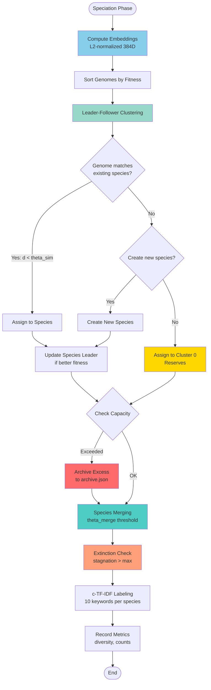

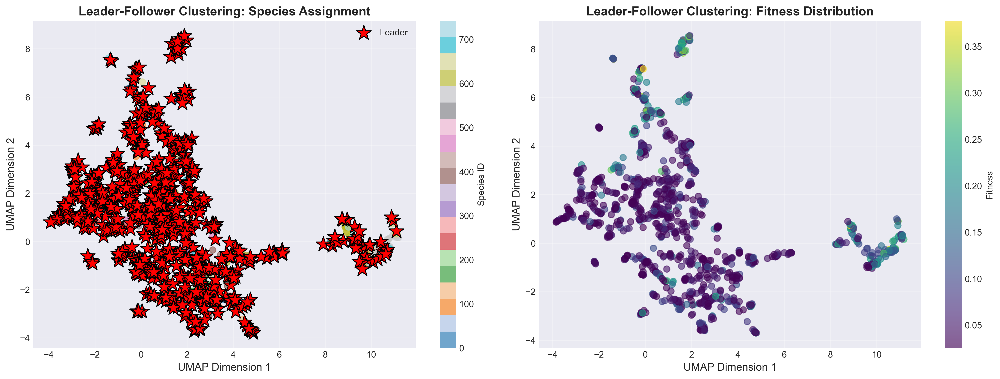
*Figure 2: Semantic space visualization showing the distribution of prompts in the embedding space and species clusters.*

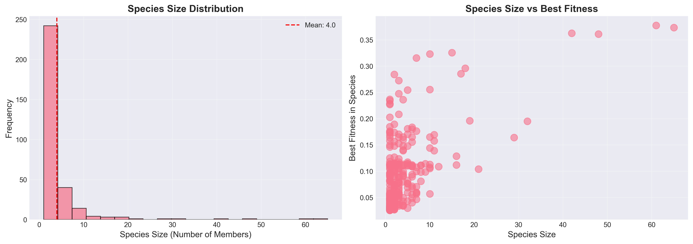
*Figure 3: Species analysis showing the characteristics and evolution of different species over time.*

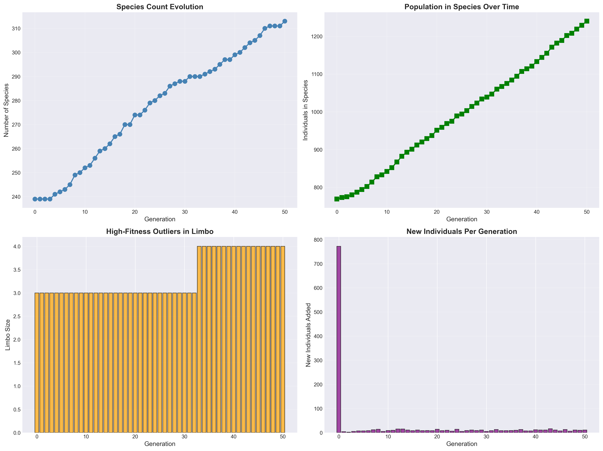
*Figure 4: Incremental evolution showing how species adapt and evolve across generations.*

**Key Components**:

1. **Embedding Computation**: L2-normalized 384-dim embeddings using all-MiniLM-L6-v2
2. **Leader-Follower Clustering**: Fitness-sorted assignment to species based on ensemble distance (theta_sim threshold)
   - **Leader Definition**: Best-fitness member in each species
   - **Incremental Updates**: Only species that receive new members are updated (capacity enforcement, fitness recording)
3. **Reserves (Cluster 0)**: Holding area for high-fitness outliers that don't fit existing species
   - Part of active population (population = elites + reserves)
   - Fixed capacity (cluster0_max_capacity), excess archived
   - New species can be created from reserves via agglomerative clustering
4. **Species Operations**:
   - **Merging**: Combine similar species when `d_ensemble(leader(Sᵢ), leader(Sⱼ)) < theta_merge`
   - **Extinction**: Freeze species when `stagnation(Sᵢ) > max_stagnation`, where `stagnation(Sᵢ) = g - g_last_improvement(Sᵢ)`
   - **Capacity Enforcement**: Remove excess genomes when `|Sᵢ| > C_species` or `|Cluster_0| > C_reserves`
5. **c-TF-IDF Labeling**: Each species gets 10 keyword labels based on member prompts
6. **Metrics Tracking**: Species count, diversity, merge/extinction events, budget

**Integration Point**: After fitness evaluation (moderation), before distribution. Each genome receives a species_id field for species-aware operations.

**Mathematical Framework**:

**Genotype Distance (Semantic)**: `d_genotype(u, v) = 1 - (e_u · e_v) ∈ [0, 2]` where `e_u, e_v ∈ ℝ³⁸⁴` are L2-normalized embeddings: `||e_u||_2 = ||e_v||_2 = 1`.

Normalized to [0, 1]: `d_genotype_norm(u, v) = (1 - (e_u · e_v)) / 2 ∈ [0, 1]`

**Phenotype Distance (Toxicity)**: `d_phenotype(u, v) = ||p_u - p_v||_2 / sqrt(8) ∈ [0, 1]` where `p_u, p_v ∈ [0,1]⁸` are 8-dimensional toxicity score vectors (all 8 Perspective API attributes: TOXICITY, SEVERE_TOXICITY, IDENTITY_ATTACK, INSULT, PROFANITY, THREAT, SEXUALLY_EXPLICIT, FLIRTATION).

**Ensemble Distance**: `d_ensemble(u, v) = α * d_genotype_norm(u, v) + β * d_phenotype(u, v) ∈ [0, 1]` where `α = 0.7` and `β = 0.3` (`α + β = 1`).

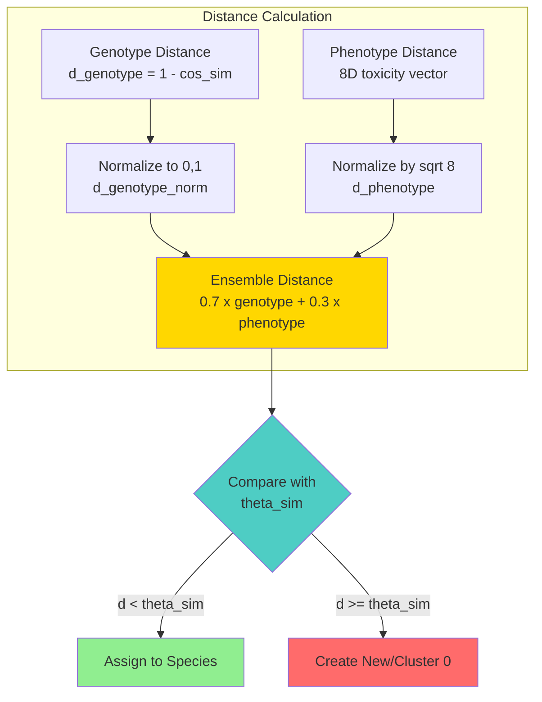

**Geometry Note**:
- All embeddings live on the 384D unit hypersphere: `{e ∈ ℝ³⁸⁴ : ||e||₂ = 1}`. Cosine distance creates **cone-shaped** clusters, not Euclidean spheres.
- Thresholds correspond to angles: `θ_sim = 0.2` means ensemble distance threshold for assignment.

**Clustering Thresholds**:
- Species assignment: `d_ensemble(u, leader(Sᵢ)) < theta_sim` → assign to species `Sᵢ` (default: `theta_sim = 0.2`)
- Species merging: `d_ensemble(leader(Sᵢ), leader(Sⱼ)) < theta_merge` → merge `Sᵢ` and `Sⱼ` (default: `theta_merge = 0.1`, where `theta_merge < theta_sim`)
- No match: `d_ensemble(u, leader(Sᵢ)) >= theta_sim` for all `i` → assign to Cluster 0 (reserves)

**Capacity Limits**:
- `|Sᵢ| <= C_species` for all `i` (default: `C_species = 100`)
- `|Cluster_0| <= C_reserves` (default: `C_reserves = 1000`)

Excess genomes are archived to `archive.json` (NOT part of population).

**Leader Definition**: `leader(Sᵢ) = argmax_{x ∈ Sᵢ} f(x)`. The leader is the genome with highest fitness in each species.

**Complexity**: `O(N × K × d)` per generation where:
- `N` = population size
- `K` = number of species
- `d` = embedding dimension (384)

## Generation-by-Generation Flow


*Figure 5: Cluster evolution grid showing how species clusters form, merge, and evolve over generations.*

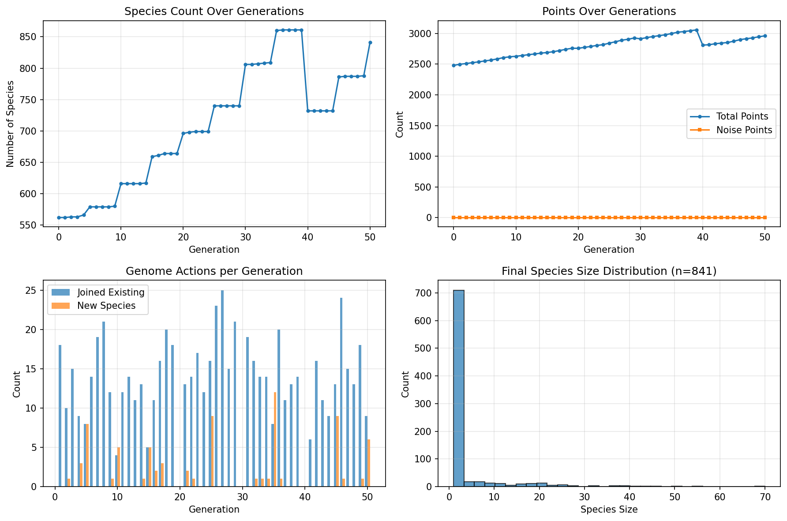
*Figure 6: Species evolution timeline showing the birth, growth, merging, and extinction of species throughout the evolutionary process.*

### Generation 0 (Initialization)

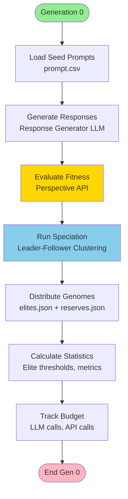

### Generation N (Evolution Loop)

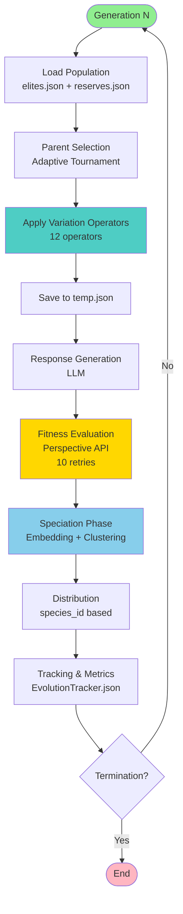

**Detailed Steps**:

1. **Evolution Phase**:
   - Load population from elites.json and reserves.json
   - Parent Selection (adaptive tournament, species-aware)
   - Apply Variation Operators (12 mutation/crossover operators)
   - Save variants to temp.json
   - Track operator statistics (rejections, duplicates)

2. **Response Generation**:
   - Generate LLM responses for all variants in temp.json
   - Update temp.json with generated responses
   - Track response generation time

3. **Fitness Evaluation**:
   - Evaluate toxicity using Moderation Oracle (Perspective API)
   - **10 retries** with exponential backoff for rate limits
   - Update temp.json with fitness scores (toxicity, north_star_score)
   - Track evaluation time and API calls

4. **Speciation Phase**:
   - **Embedding Computation**: Compute L2-normalized embeddings for all prompts
   - **Leader-Follower Clustering**: Assign genomes to species based on ensemble distance (theta_sim threshold)
   - **Reserves Management**: Assign outliers to Cluster 0 (species_id = 0)
   - **Species Merging**: Merge similar species if leaders are close (theta_merge threshold)
   - **Extinction Check**: Freeze stagnant species (stagnation > max_stagnation)
   - **Capacity Enforcement**: Remove excess genomes from species/reserves when capacity exceeded, archive to archive.json
   - **c-TF-IDF Labeling**: Update species labels with current generation data
   - **Metrics Recording**: Track species count, diversity, merge/extinction events
   - Update all genomes in temp.json with species_id (Cluster 0 = 0)
   - Remove prompt_embedding from temp.json after speciation to reduce storage

5. **Distribution Phase**:
   - Distribute genomes based on species_id:
     - species_id > 0 -> elites.json (part of active population)
     - species_id == 0 -> reserves.json (part of active population)
   - Archived genomes -> archive.json (NOT part of population)
   - Active population = elites.json + reserves.json

6. **Tracking Phase**:
   - Update EvolutionTracker.json with generation metrics:
     - Fitness statistics (best, avg, min, max)
     - Speciation metrics (species count, diversity)
     - Budget metrics (LLM calls, API calls, times)
     - Operator statistics (per-operator counts)
   - Generate operator_effectiveness_cumulative.csv
   - Generate visualization figures

7. **Termination Check**: Terminate if `g >= g_max` or `max_{x∈P} f(x) >= f_threshold`, otherwise continue to next generation, where `g` = current generation, `g_max` = maximum generations (if set), `f_threshold` = fitness threshold (default: 0.99).

### Data Flow

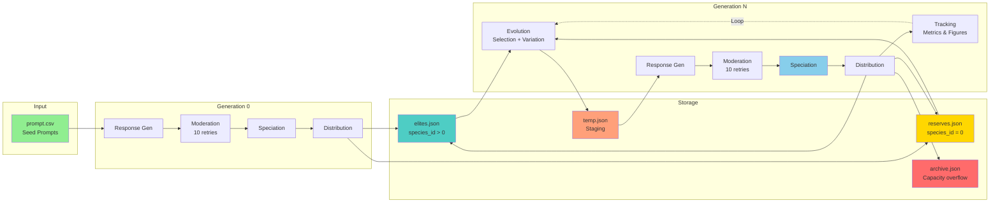


*Figure 7: UMAP and MDS visualizations of the final state of the semantic space, showing the final distribution of species and their relationships.*

### Key Data Structures

**Genome Dictionary** (in JSON files):
```python
{
    "id": int,
    "prompt": str,
    "generated_output": str,
    "toxicity": float,  # Fitness score
    "north_star_score": float,
    "species_id": int,  # Added by speciation module
    "generation": int,
    "operator": str,
    "variant_type": str,
    "moderation_result": {
        "google": {
            "scores": {
                "toxicity": float,
                "severe_toxicity": float,
                # ... 8 total attributes
            }
        }
    },
    "response_duration": float,  # LLM response time
    "evaluation_duration": float,  # API evaluation time
    # ... other metadata
}
```

**Species Structure** (in-memory and speciation_state.json):
```python
Species(
    id: int,
    leader: Individual,  # Best-fitness member (highest fitness)
    members: List[Individual],
    state: str,  # "active" | "stagnant" | "frozen"
    stagnation_counter: int,
    fitness_history: List[float],  # Best fitness per generation
    labels: List[str],  # c-TF-IDF keywords (10 words)
    label_history: List[Dict]  # Historical labels with fitness
)
```

## Metrics and Statistics

### Per-Generation Metrics (Live)

Tracked in `EvolutionTracker.json`:

| Metric | Formula | Description |
|--------|---------|-------------|
| **best_fitness** | `f_max = max_{x∈P_g} f(x)` | Maximum fitness in generation `g` |
| **avg_fitness_generation** | `f_bar_new = (1/|V_g|) Σ_{v∈V_g} f(v)` | Mean fitness of new variants in generation `g` |
| **avg_fitness_history** | `f_bar_hist = (1/|P|) Σ_{x∈P} f(x)` | Running average across active population `P` |
| **elites_count** | `|E| = Σᵢ |Sᵢ|` | Number of genomes in species |
| **reserves_count** | `|R| = |Cluster_0|` | Number of genomes in Cluster 0 |
| **species_count** | `K = |{Sᵢ : state(Sᵢ) = "active"}|` | Number of active species |
| **inter_species_diversity** | `D_inter = (1/(K(K-1)/2)) Σ_{i<j} d_ensemble(leader(Sᵢ), leader(Sⱼ))` | Average distance between species leaders |
| **intra_species_diversity** | `D_intra = (1/K) Σᵢ (1/(|Sᵢ|(|Sᵢ|-1)/2)) Σ_{u,v∈Sᵢ, u≠v} d_ensemble(u,v)` | Average distance within species |
| **llm_calls** | `N_LLM = |{x : x has response_duration}|` | Number of LLM response generations |
| **api_calls** | `N_API = |{x : x has evaluation_duration}|` | Number of Perspective API evaluations |

where:
- `P_g` = population at generation `g`
- `V_g` = new variants generated in generation `g`
- `P` = active population (elites + reserves)

### Operator Effectiveness Metrics

Tracked in `operator_effectiveness_cumulative.csv`:

| Metric | Formula | Description |
|--------|---------|-------------|
| **NE** | `NE = 1 - (|V_elite| / |V_total|)` | Non-Elite Percentage |
| **EHR** | `EHR = |V_elite| / |V_total|` | Elite Hit Rate |
| **IR** | `IR = (|V_rejected| + |V_duplicate|) / |V_attempted|` | Invalid/Rejection Rate |
| **cEHR** | `cEHR = |V_elite| / (|V_total| - |V_invalid|)` | Conditional Elite Hit Rate |
| **Delta_mu** | `Delta_mu = (1/|V_valid|) Σ_{v∈V_valid} (f(v) - f(parent(v)))` | Mean Delta Score |
| **Delta_sigma** | `Delta_sigma = sqrt(Var({f(v) - f(parent(v)) : v ∈ V_valid}))` | Std Dev Delta Score |

where:
- `V_total` = total variants generated by operator
- `V_elite` = variants that became elites
- `V_rejected` = variants rejected by operator
- `V_duplicate` = duplicate variants
- `V_invalid` = `V_rejected ∪ V_duplicate`
- `V_valid` = `V_total \ V_invalid`
- `f(x)` = fitness of genome `x`
- `parent(v)` = parent genome of variant `v`

### Cluster Quality Metrics (Post-hoc)

Available via `utils/cluster_quality.py`:

| Metric | Formula | Description |
|--------|---------|-------------|
| **Silhouette Score** | `s = (1/N) Σᵢ (b(i) - a(i)) / max(a(i), b(i))` | Measures cluster separation and cohesion ∈ [-1, 1] |
| **Davies-Bouldin Index** | `DB = (1/K) Σᵢ max_{j≠i} ((sigma_i + sigma_j) / d(mu_i, mu_j))` | Lower values indicate better clustering |
| **Calinski-Harabasz Index** | `CH = (tr(B) / (K-1)) / (tr(W) / (N-K))` | Higher values indicate better defined clusters |

where:
- `a(i)` = average distance from point `i` to other points in same cluster
- `b(i)` = minimum average distance from point `i` to points in other clusters
- `σᵢ` = average distance within cluster `i`
- `μᵢ` = centroid of cluster `i`
- `d(μᵢ, μⱼ)` = distance between cluster centroids
- `B` = between-cluster scatter matrix
- `W` = within-cluster scatter matrix
- `tr()` = trace of matrix

## Error Handling

### Perspective API Rate Limits

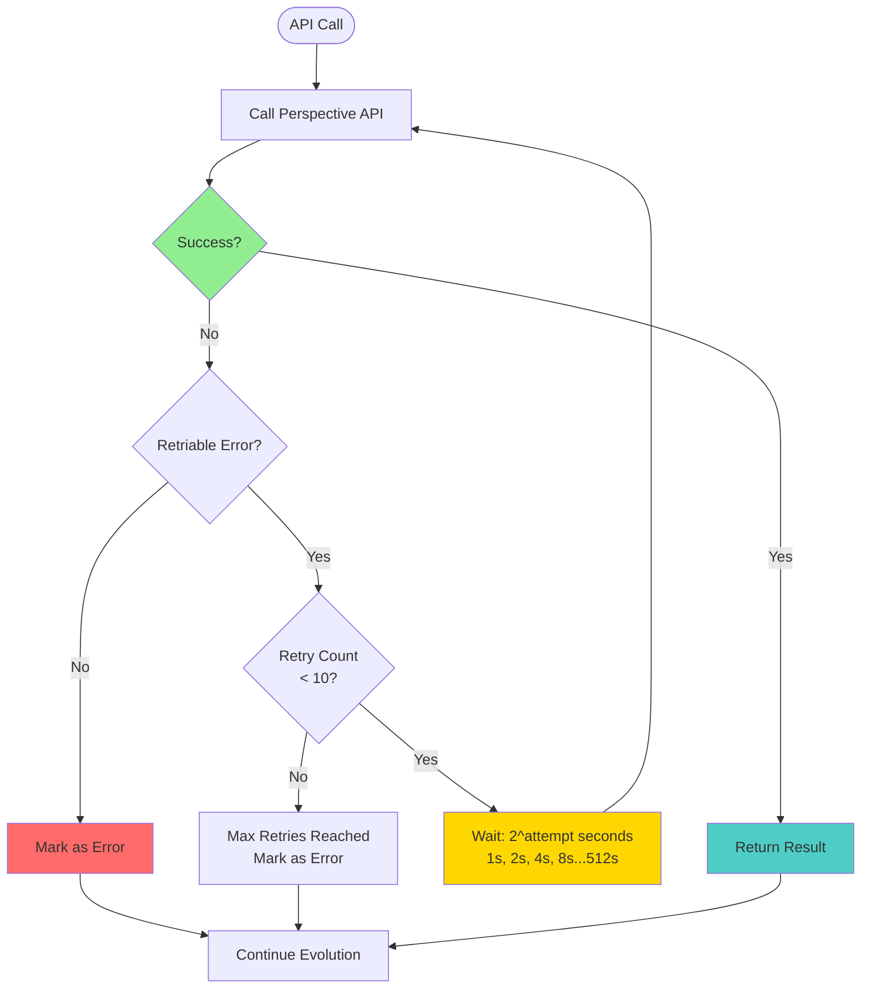

The system handles rate limits gracefully:
- **10 retries** (11 total attempts) with exponential backoff
- Wait times double each retry: 1s, 2s, 4s, 8s, 16s, 32s, 64s, 128s, 256s, 512s
- Automatic detection of retriable errors (429, 5xx, timeout, network)
- 0.75s delay between evaluations to stay within per-minute quota

### Missing Data Handling

- **None phenotypes**: Falls back to genotype-only distance
- **Empty temp.json**: Speciation still records current state to tracker
- **Missing moderation attributes**: Set to 0, keeping D=8
- **API failures after all retries**: Genome marked as error, evolution continues

### Data Integrity

- **Incremental saves**: Genomes saved immediately after evaluation for crash recovery
- **Batch saves**: Final batch save ensures consistency
- **Archive creation**: archive.json created automatically when needed
- **Tracker always updated**: Even with no new variants, speciation data is recorded

## Summary: Speciation Integration

### Benefits

1. **Diversity Preservation**: Semantic clustering maintains distinct evolutionary niches
2. **Parallel Search**: Multiple species explore different regions of the fitness landscape simultaneously
3. **Outlier Management**: Reserves (Cluster 0) preserves high-fitness outliers that don't fit existing species
4. **Dynamic Adaptation**: Species merge when similar, freeze when stagnant
5. **Capacity Management**: Automatic archiving of excess genomes maintains population size
6. **Interpretability**: c-TF-IDF labels provide human-readable species descriptions

### Integration Status

IMPLEMENTED: All speciation components are complete and integrated into main.py

### Usage

Speciation runs automatically each generation after fitness evaluation:

```python
from speciation import run_speciation
from speciation.config import SpeciationConfig

# Create config (or use defaults)
config = SpeciationConfig(
    theta_sim=0.2,      # Ensemble distance threshold for assignment
    theta_merge=0.1,    # Merge threshold
    species_capacity=100,
    cluster0_max_capacity=1000
)

# In generation loop, after fitness evaluation:
result = run_speciation(
    temp_path="data/outputs/temp.json",
    current_generation=generation_count,
    config=config
)

# Genomes are automatically distributed to elites.json and reserves.json
# based on species_id assigned during clustering
```

### Configuration

Key parameters in SpeciationConfig:
- theta_sim=0.2: Ensemble distance threshold for species assignment
- theta_merge=0.1: Merge threshold (tighter than theta_sim)
- species_capacity=100: Maximum individuals per species
- cluster0_max_capacity=1000: Maximum individuals in reserves (Cluster 0)
- cluster0_min_cluster_size=2: Minimum size for new species from reserves
- max_stagnation=20: Maximum generations without improvement before species is frozen
- min_island_size=2: Minimum species size before moving to reserves

See src/speciation/config.py for full configuration options.

## File Structure

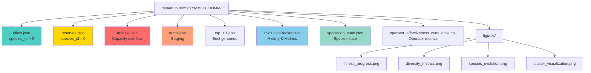

**File Descriptions**:
- `elites.json`: Genomes in species (species_id > 0)
- `reserves.json`: Cluster 0 outliers (species_id = 0)
- `archive.json`: Archived genomes (capacity overflow)
- `temp.json`: Current generation staging
- `top_10.json`: Top 10 highest-fitness genomes
- `EvolutionTracker.json`: Complete evolution history
- `speciation_state.json`: Species state with labels
- `operator_effectiveness_cumulative.csv`: Per-generation operator metrics
- `figures/`: Visualization charts (fitness_progress.png, diversity_metrics.png, etc.)
