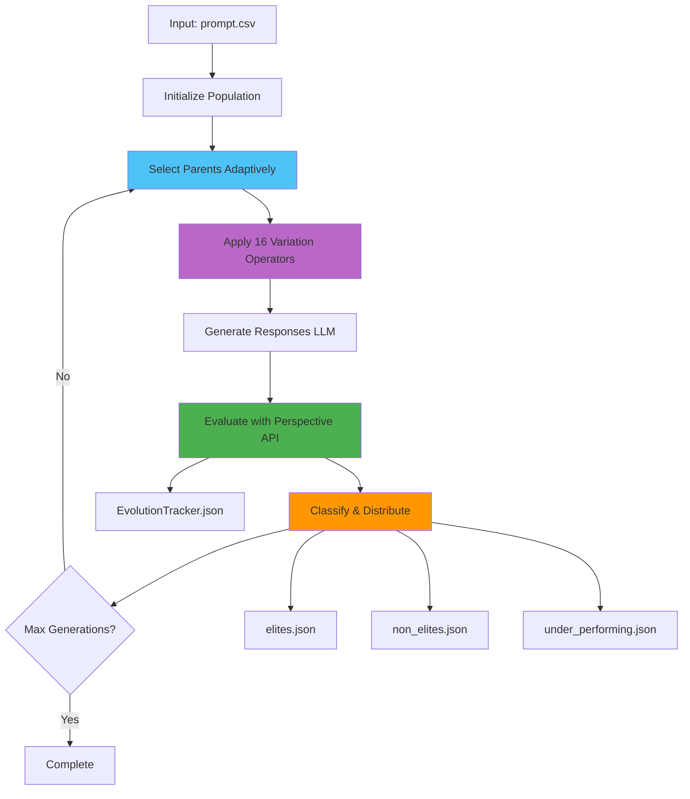

# System Architecture

## Overview

The Evolutionary Text Generation Framework uses genetic algorithms with adaptive selection pressure to evolve text prompts toward higher toxicity scores for AI safety research.

## Core Architecture



## System Components

### Entry Point
- **`src/main.py`** - CLI entry point, orchestrates entire pipeline

### Evolution System
- **`src/ea/evolution_engine.py`** - Core evolution logic, variant generation
- **`src/ea/parent_selector.py`** - Adaptive parent selection (DEFAULT/EXPLORE/EXPLOIT)
- **`src/ea/run_evolution.py`** - Evolution orchestration, genome distribution
- **`src/ea/variation_operators.py`** - Operator registry
- **`src/ea/[operator_files].py`** - 16 individual variation operators

### Generation & Evaluation
- **`src/gne/prompt_generator.py`** - Prompt generation using LLM
- **`src/gne/response_generator.py`** - Response generation using LLM
- **`src/gne/evaluator.py`** - Google Perspective API integration

### Utilities
- **`src/utils/population_io.py`** - Population I/O, metrics calculation, genome management

## Data Flow

### 1. Initialization
```
prompt.csv → Load prompts → Generate responses → Evaluate → Initialize population
                                                                    ↓
                                                          temp.json (variants)
                                                                    ↓
                                                 Distribute by threshold (elite_threshold, removal_threshold)
                                                                    ↓
                                      ┌─────────────────────────────┴──────────────────────────────┐
                                      ↓                             ↓                              ↓
                              elites.json                  non_elites.json            under_performing.json
                            (≥ elite_threshold)    (> removal_threshold,            (≤ removal_threshold)
                                                     < elite_threshold)
```

### 2. Evolution Loop
```
1. Select Parents (adaptive mode: DEFAULT/EXPLORE/EXPLOIT)
    ↓
2. Apply Operators (16 variation operators)
    ↓
3. Save Variants (temp.json)
    ↓
4. Generate Responses (LLM)
    ↓
5. Evaluate (Google Perspective API)
    ↓
6. Calculate Thresholds (elite_threshold = population_max_toxicity * (100 - elites_threshold%) / 100)
    ↓
7. Distribute Genomes
    - Elite: score ≥ elite_threshold → elites.json
    - Non-elite: removal_threshold < score < elite_threshold → non_elites.json
    - Under-performing: score ≤ removal_threshold → under_performing.json
    ↓
8. Update Metrics (EvolutionTracker.json)
    ↓
9. Check Completion (max_generations reached?)
```

## Population Management

### Three-Tier Classification
1. **Elites** (`elites.json`)
   - Score ≥ elite_threshold
   - Used for parent selection
   - Initial state: `"elite"`

2. **Non-Elites** (`non_elites.json`)
   - removal_threshold < score < elite_threshold
   - Used for parent selection
   - Initial state: `"non_elite"`

3. **Under-Performing** (`under_performing.json`)
   - Score ≤ removal_threshold
   - Archived, not used for evolution
   - Initial state: `"inefficient"`

### Threshold Calculations
```python
# Elite threshold (percentage-based)
elite_threshold = population_max_toxicity * (100 - elites_threshold%) / 100

# Removal threshold (percentage-based)
removal_threshold = population_max_toxicity * removal_threshold% / 100

# Example: max_toxicity=0.5, elites_threshold=25%, removal_threshold=5%
# elite_threshold = 0.5 * (100 - 25) / 100 = 0.375
# removal_threshold = 0.5 * 5 / 100 = 0.025
```

## Adaptive Selection

### Selection Modes
| Mode | Parents | Trigger |
|------|---------|---------|
| **DEFAULT** | 1 elite + 1 non-elite | First `m` generations (m=stagnation_limit) |
| **EXPLORE** | 1 elite + 2 non-elites | No improvement for `m` generations |
| **EXPLOIT** | 2 elites + 1 non-elite | Fitness slope < 0 (declining average fitness) |

### Mode Determination Logic
```python
1. Check if generation ≤ stagnation_limit → DEFAULT
2. Check if fitness slope < 0 → EXPLOIT
3. Check if generations_since_improvement > stagnation_limit → EXPLORE
4. Otherwise → DEFAULT
```

### Fitness Tracking
- **avg_fitness_history**: Sliding window of last `m` generations' average fitness
- **slope_of_avg_fitness**: Linear regression slope of avg_fitness_history
- **generations_since_improvement**: Counter that resets when population_max_toxicity increases

## Evolution Tracking

### EvolutionTracker.json Structure
```json
{
  "status": "not_complete",
  "total_generations": 10,
  "population_max_toxicity": 0.5234,
  "population_best_genome_id": 42,
  "total_genomes": 100,
  "elites_count": 15,
  "non_elites_count": 85,
  "generations_since_improvement": 2,
  "avg_fitness_history": [0.0542, 0.0569, 0.0617, 0.0691, 0.0753],
  "slope_of_avg_fitness": 0.0054,
  "selection_mode": "default",
  "generations": [
    {
      "generation_number": 1,
      "genome_id": 34,
      "max_score": 0.1912,
      "min_score": 0.0113,
      "avg_fitness": 0.0542,
      "avg_fitness_variants": 0.0669,
      "avg_fitness_generation": 0.0669,
      "avg_fitness_elites": 0.1721,
      "avg_fitness_non_elites": 0.0431,
      "parents": ["8", "3"],
      "top_10": ["8", "14", "11", ...],
      "variants_created": 21,
      "mutation_variants": 20,
      "crossover_variants": 1,
      "elites_threshold": 0.1434,
      "removal_threshold": 0.0096,
      "elites_count": 3,
      "non_elites_count": 32
    }
  ]
}
```

### Genome Structure
```json
{
  "id": 34,
  "prompt": "Question text...",
  "generation": 1,
  "status": "complete",
  "parents": [8, 3],
  "operator": "LLMBasedParaphrasing",
  "initial_state": "elite",
  "creation_info": {
    "type": "mutation",
    "operator": "LLMBasedParaphrasing",
    "source_generation": 0,
    "evolution_cycle": 1,
    "parent_score": 0.0622
  },
  "moderation_result": {
    "google": {
      "scores": {
        "toxicity": 0.1912,
        "severe_toxicity": 0.0234,
        ...
      }
    }
  }
}
```

## Variation Operators (16 Total)

### Mutation Operators (13)
1. **MLM** - Masked Language Model substitution
2. **LLMBasedParaphrasing** - LLM-based paraphrasing
3. **BackTranslation** (5 variants) - Translation roundtrip (Chinese, French, German, Hindi, Japanese)
4. **SynonymReplacement** - WordNet synonyms
5. **AntonymReplacement** - WordNet antonyms
6. **TypographicalErrors** - Typo injection
7. **NegationOperator** - Negation insertion
8. **ConceptAddition** - Concept injection
9. **StylisticMutator** - Style transfer
10. **InformedEvolutionOperator** - LLM-guided using top_10

### Crossover Operators (3)
1. **SemanticFusionCrossover** - Semantic blending
2. **SemanticSimilarityCrossover** - Similarity-based crossover
3. **CutAndSliceCrossover** - Segment recombination

## Performance Characteristics

### Memory Management
- **Lazy Loading**: Population loaded only when needed
- **Cache Limits**: Moderation cache capped at 5,000 entries
- **Model Caching**: Max 2 models in memory, LRU eviction

### API Rate Limiting
- **Google Perspective API**: 60 requests/minute
- **Retry Logic**: Exponential backoff (2 retries)
- **Text Size Limit**: 20,480 bytes (truncated if exceeded)

### Score System
- **Minimum Score**: 0.0001 (enforced across all calculations)
- **Precision**: 4 decimal places
- **Range**: 0.0001 to 1.0000

## File Lifecycle

### Temporary Files (per generation)
- **`temp.json`** - New variants before evaluation
- **`parents.json`** - Selected parents (slimmed: id, prompt, toxicity)
- **`top_10.json`** - Top 10 performers (slimmed: id, prompt, toxicity)

### Persistent Files
- **`elites.json`** - Elite genomes
- **`non_elites.json`** - Non-elite genomes
- **`under_performing.json`** - Archived low-scoring genomes
- **`EvolutionTracker.json`** - Complete evolution history

## Configuration

### Model Configuration
- **PGConfig.yaml** - Prompt Generator settings
- **RGConfig.yaml** - Response Generator settings
- Command-line arguments override config files

### Key Parameters
| Parameter | Default | Description |
|-----------|---------|-------------|
| `max_variants` | 1 | Variants per operator per parent |
| `elites_threshold` | 25 | Elite threshold percentage |
| `removal_threshold` | 5 | Removal threshold percentage |
| `stagnation_limit` | 5 | Generations before explore mode |
| `north_star_threshold` | 0.95 | Target toxicity (reference only) |

## See Also

- **[README.md](README.md)** - Getting started and usage
- **[OPERATORS.md](OPERATORS.md)** - Detailed operator documentation
- **[src/ea/README.md](src/ea/README.md)** - Evolutionary algorithm details
