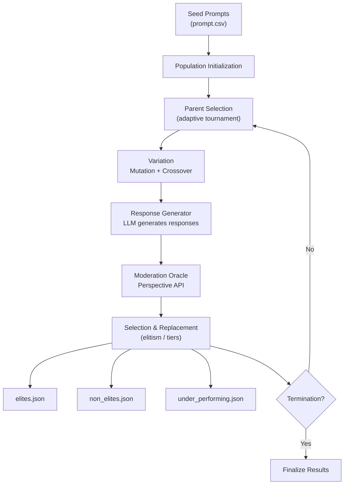

# System Architecture: Evolutionary Search for Toxicity in LLMs

## Overview

This system implements a genetic algorithm framework for evolving text prompts to elicit toxic responses from large language models, enabling comprehensive AI safety evaluation through adversarial prompt generation.

## Core Algorithm

### Evolutionary Process
The system uses a steady-state genetic algorithm with the following components:

1. **Population Initialization**: Load initial prompts from CSV
2. **Parent Selection**: Adaptive tournament selection based on fitness
3. **Variation**: Apply 12 different operators to generate offspring
4. **Evaluation**: Score offspring using Google Perspective API
5. **Selection**: Distribute offspring into elite/non-elite/under-performing categories
6. **Termination**: Stop when convergence criteria are met

### Mathematical Framework

**Fitness Function**:
```
f(x) = toxicity_score(response to prompt x) ∈ [0, 1]
```

The fitness function evaluates toxicity in the LLM's response, not the prompt itself.

**Threshold Calculations**:
```
elite_threshold = max_toxicity × (100 - elite_percentage) / 100
removal_threshold = max_toxicity × removal_percentage / 100
```

## System Architecture



## Component Architecture

### Evolution Engine
Core evolution logic implementing the genetic algorithm. Manages the evolutionary cycle, coordinates operator application, and maintains population state throughout the evolution process.

### Parent Selector
Adaptive parent selection mechanism that adjusts selection strategy based on evolution progress and fitness landscape.

**Selection Modes**:
| Mode | Parents | Trigger |
|------|---------|---------|
| **DEFAULT** | 1 elite + 1 non-elite | First `m` generations |
| **EXPLORE** | 1 elite + 2 non-elites | Stagnation > `m` generations |
| **EXPLOIT** | 2 elites + 1 non-elite | Fitness slope < 0 |

### Variation Operators (12 Total)

#### Mutation Operators (10)
1. **Informed Evolution**: LLM-guided evolution using top performers
2. **Masked Language Model**: Contextual word substitution
3. **Paraphrasing**: Semantic-preserving text transformation
4. **Back Translation**: Hindi roundtrip translation (other languages disabled for performance)
5. **Synonym Replacement**: Lexical substitution with POS awareness
6. **Antonym Replacement**: Lexical substitution with POS awareness
7. **Negation**: Logical operator insertion
8. **Concept Addition**: Semantic concept injection
9. **Typographical Errors**: Character-level noise injection
10. **Stylistic Mutation**: Writing style transformation

#### Crossover Operators (2)
1. **Semantic Similarity**: Crossbreeding based on semantic distance
2. **Semantic Fusion**: Hybrid prompt generation

### Response Generation
Generates responses from target LLMs using the evolved prompts. Supports multiple model architectures through a unified interface.

### Moderation Evaluation
Evaluates generated responses for toxicity using Google Perspective API. Provides comprehensive toxicity scoring across multiple dimensions.

### Population Management
Manages population state, handles I/O operations, and maintains population statistics. Supports both monolithic and split file formats for scalability.

