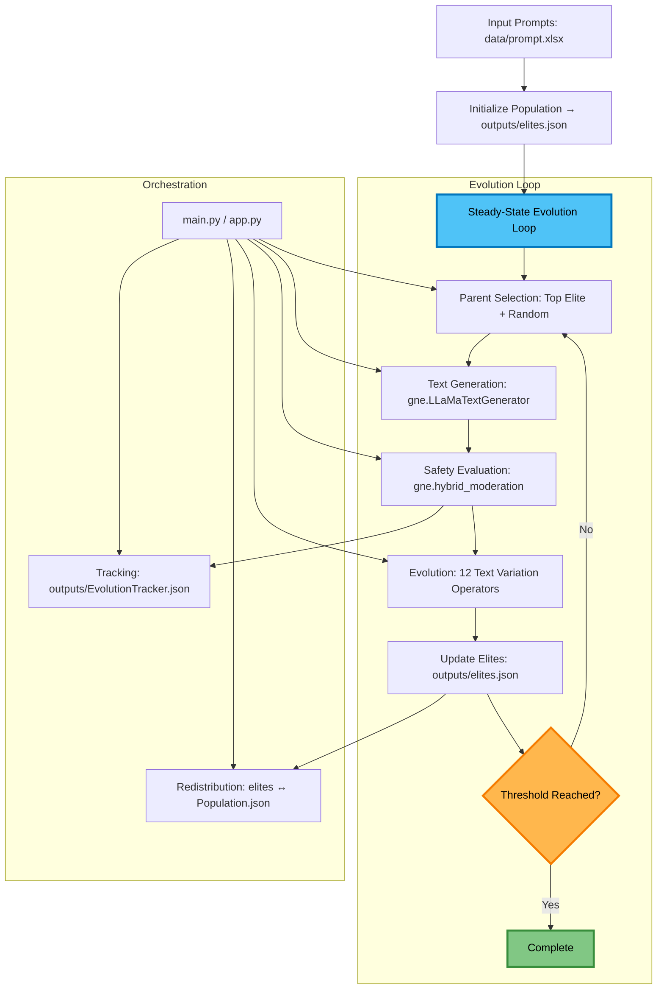
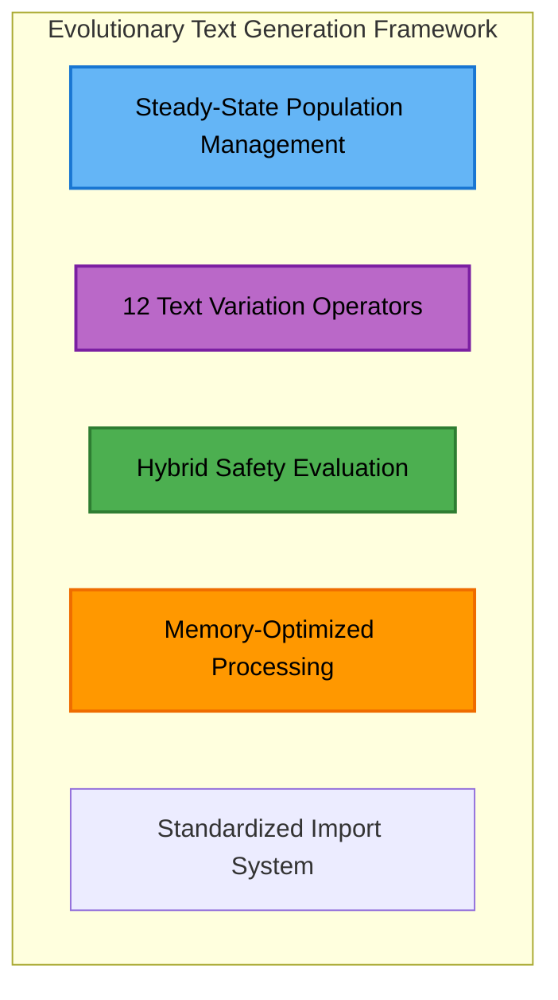
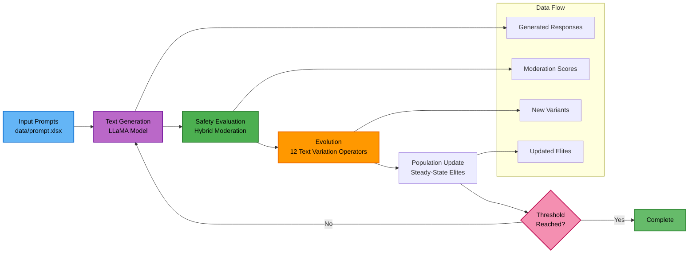
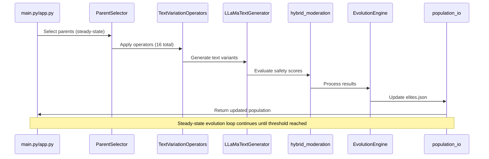
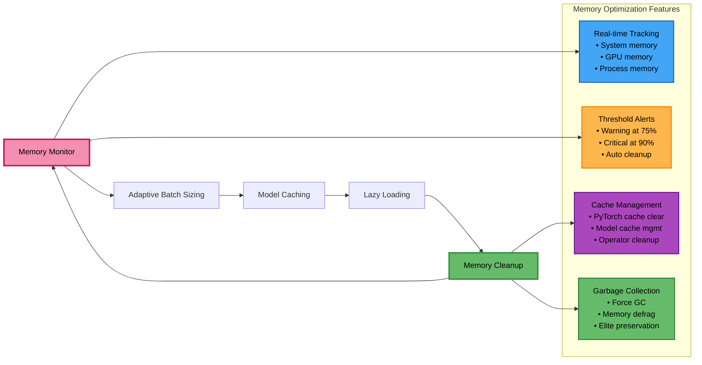
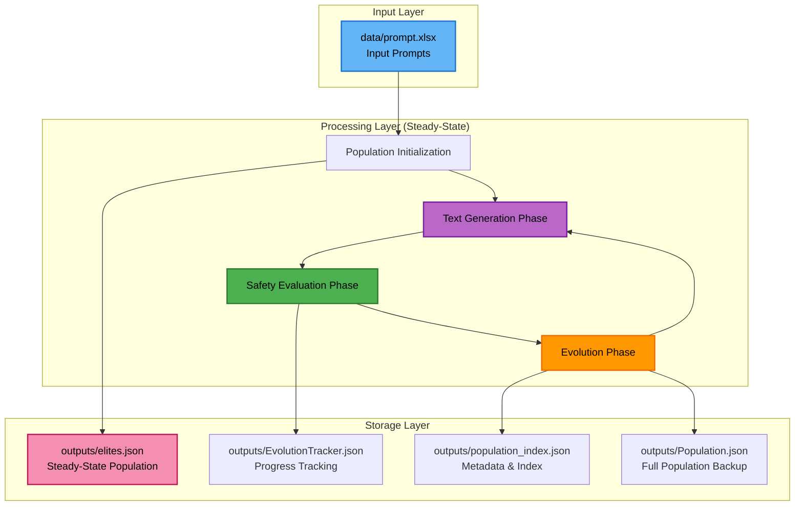

# Project Architecture

## Architecture at a glance



## System Overview



## Core Pipeline Flow



## Recent Architecture Improvements

### **Steady-State Population Management**
- **Elite Preservation**: Top performers maintained in `elites.json`
- **Continuous Evolution**: Population evolves continuously without generation boundaries
- **Dynamic Redistribution**: Elites redistributed to population when thresholds exceeded
- **Memory Efficiency**: Single-file population with lazy loading

### **12 Text Variation Operators**
- **10 Mutation Operators**: Including 5 LLM-based back-translation operators (5 languages)
- **2 Crossover Operators**: Semantic similarity and instruction-preserving
- **LLM-Based Approaches**: LLaMA-based text variation across all operators
- **Multi-Language Support**: Hindi, French, German, Japanese, Chinese

### **Enhanced Evolution Tracking**
- `EvolutionTracker.json`: Comprehensive generation performance tracking
- `population_index.json`: Fast population metadata and counts
- Accurate max_score: Represents actual generation performance, not parent scores

### **Memory Optimization**
- Lazy Imports: Prevents circular dependencies and premature model loading
- Targeted Loading: Filter in memory by generation/prompt as needed
- Absolute Paths: Robust cross-platform file handling
- Model Caching: Efficient reuse of loaded models across operators

## Detailed Component Architecture

```
┌─────────────────────────────────────────────────────────────────────────────┐
│                              MAIN PIPELINE                                 │
│  ┌─────────────────┐  ┌─────────────────┐  ┌─────────────────┐           │
│  │   Population    │  │   Text          │  │   Safety        │           │
│  │  Initialization │  │  Generation     │  │  Evaluation     │           │
│  │                 │  │                 │  │                 │           │
│  │ • Load prompts  │  │ • LLaMA Model   │  │ • Hybrid API    │           │
│  │ • Create        │  │ • Task Templates│  │ • Google +      │           │
│  │   genomes       │  │ • Memory Mgmt   │  │   OpenAI        │           │
│  │ • Set status    │  │ • Batch Proc    │  │ • Toxicity      │           │
│  │ • Steady state  │  │ • Error Handle  │  │   Scoring       │           │
│  │ • Elite mgmt    │  │ • Lazy loading  │  │ • Multi-metric  │           │
│  └─────────────────┘  └─────────────────┘  └─────────────────┘           │
│           │                   │                   │                       │
│           ▼                   ▼                   ▼                       │
│  ┌─────────────────┐  ┌─────────────────┐  ┌─────────────────┐           │
│  │   Evolution     │  │   Population    │  │   Analysis      │           │
│  │   Engine        │  │   Management    │  │   & Logging     │           │
│  │                 │  │                 │  │                 │           │
│  │ • Genetic Algo  │  │ • Steady State  │  │ • Performance   │           │
│  │ • 16 Operators  │  │ • Elite Track   │  │   Monitoring    │           │
│  │ • Mutation      │  │ • Status Track  │  │ • Memory Stats  │           │
│  │ • Crossover     │  │ • Lineage       │  │ • Error Logs    │           │
│  │ • Selection     │  │ • Deduplication │  │ • Evolution     │           │
│  │ • Accurate      │  │ • Index Mgmt    │  │   Tracking      │           │
│  │   Tracking      │  │ • Lazy Loading  │  │ • Operator      │           │
│  │ • Multi-lang    │  │ • Redistribution│  │   Analytics     │           │
│  └─────────────────┘  └─────────────────┘  └─────────────────┘           │
└─────────────────────────────────────────────────────────────────────────────┘
```

## Text Variation Operators Architecture

```mermaid
graph TB
  subgraph "Text Variation Operators (12 Total)"
    subgraph "Mutation Operators (13)"
      A1[Core LLM Operators]
      A2[BERT-based Operators]
      A3[OpenAI Operators]
      
      subgraph "Back-Translation (10)"
        B1[Model-Based: Helsinki-NLP]
        B2[LLM-Based: LLaMA]
        
        subgraph "Languages (5)"
          C1[Hindi (HI)]
          C2[French (FR)]
          C3[German (DE)]
          C4[Japanese (JA)]
          C5[Chinese (ZH)]
        end
        
        B1 --> C1
        B1 --> C2
        B1 --> C3
        B1 --> C4
        B1 --> C5
        
        B2 --> C1
        B2 --> C2
        B2 --> C3
        B2 --> C4
        B2 --> C5
      end
      
      A1 --> B1
      A1 --> B2
    end
    
    subgraph "Crossover Operators (3)"
      D1[One-Point Crossover<br/>Single split, Random point]
      D2[Semantic Similarity Crossover<br/>Embedding-based, Similarity threshold]
      D3[Instruction Preserving Crossover<br/>Structure-aware, Maintain instructions]
    end
  end
  
  style A1 fill:#42a5f5,stroke:#1565c0,stroke-width:2px,color:#000
  style A2 fill:#42a5f5,stroke:#1565c0,stroke-width:2px,color:#000
  style A3 fill:#42a5f5,stroke:#1565c0,stroke-width:2px,color:#000
  style B1 fill:#ab47bc,stroke:#6a1b9a,stroke-width:2px,color:#000
  style B2 fill:#ab47bc,stroke:#6a1b9a,stroke-width:2px,color:#000
  style D1 fill:#66bb6a,stroke:#2e7d32,stroke-width:2px,color:#000
  style D2 fill:#66bb6a,stroke:#2e7d32,stroke-width:2px,color:#000
  style D3 fill:#66bb6a,stroke:#2e7d32,stroke-width:2px,color:#000
```

## Component Interaction Flow



## Memory Management Architecture



## Data Flow Architecture



## Evolution Tracking Architecture

```mermaid
graph TB
  subgraph "EvolutionTracker.json Structure"
    A[Global Metadata<br/>• scope: global<br/>• status: not_complete<br/>• total_generations: 5]
    B[Population Stats<br/>• population_max_toxicity: 0.3775<br/>• population_best_genome_id: 40]
    C[Generation Records]
    
    subgraph "Generation Data"
      D[Generation 0<br/>• genome_id: 1<br/>• max_score: 0.0]
      E[Generation 2<br/>• genome_id: 122<br/>• max_score: 0.361<br/>• variants_created: 23<br/>• mutation_variants: 21<br/>• crossover_variants: 2]
      F[Parent Information<br/>• mutation_parent: {...}<br/>• crossover_parents: [...]]
    end
    
    A --> C
    B --> C
    C --> D
    C --> E
    E --> F
  end
  
  style A fill:#64b5f6,stroke:#1976d2,stroke-width:2px,color:#000
  style B fill:#ba68c8,stroke:#7b1fa2,stroke-width:2px,color:#000
  style C fill:#4caf50,stroke:#2e7d32,stroke-width:2px,color:#000
  style D fill:#ff9800,stroke:#ef6c00,stroke-width:2px,color:#000
  style E fill:#f48fb1,stroke:#c2185b,stroke-width:2px,color:#000
  style F fill:#aed581,stroke:#689f38,stroke-width:2px,color:#000
```

## File Structure Architecture

```mermaid
graph TB
  subgraph "EOST-CAM-LLM Project Structure"
    A[app.py<br/>Main entry point with setup and monitoring]
    
    subgraph "Configuration"
      B[config/modelConfig.yaml<br/>Model, task templates, and memory settings]
    end
    
    subgraph "Data"
      C[data/prompt.xlsx<br/>Input prompts]
    end
    
    subgraph "Source Code (src/)"
      D[main.py<br/>Core evolution pipeline]
      
      subgraph "Generation & Evaluation (gne/)"
        E1[LLaMaTextGenerator.py<br/>LLaMA integration with task-specific templates]
        E2[hybrid_moderation.py<br/>Hybrid safety evaluation (Google + OpenAI)]
        E3[__init__.py<br/>Lazy import functions]
      end
      
      subgraph "Evolutionary Algorithms (ea/)"
        F1[EvolutionEngine.py<br/>Genetic algorithm core (steady-state)]
        F2[Individual Operator Files<br/>12 variation operators]
        F3[ParentSelector.py<br/>Selection strategies (steady-state)]
        F4[RunEvolution.py<br/>Evolution pipeline]
        F5[__init__.py<br/>Package exports]
      end
      
      subgraph "Utilities (utils/)"
        G1[population_io.py<br/>Steady-state population management]
        G2[custom_logging.py<br/>Performance tracking]
        G3[m3_optimizer.py<br/>M3 Mac optimization]
        G4[config.py<br/>Configuration utilities]
        G5[constants.py<br/>System constants]
        G6[download_models.py<br/>Model download utilities]
        G7[__init__.py<br/>Lazy import functions]
      end
    end
    
    subgraph "Outputs"
      H1[elites.json<br/>Steady-state elite population]
      H2[Population.json<br/>Full population backup]
      H3[population_index.json<br/>Population metadata/index]
      H4[EvolutionTracker.json<br/>Evolution progress tracking]
      H5[final_statistics.json<br/>Final analysis results (optional)]
    end
    
    subgraph "Supporting Files"
      I1[logs/<br/>Log files]
      I2[tests/test_operators_demo.py<br/>Operator testing and demonstration]
      I3[design_document.md<br/>Formal design specification]
      I4[ARCHITECTURE.md<br/>Architecture document]
    end
  end
  
  A --> D
  D --> E1
  D --> F1
  D --> G1
  D --> H1
  
  style A fill:#64b5f6,stroke:#1976d2,stroke-width:2px,color:#000
  style D fill:#ba68c8,stroke:#7b1fa2,stroke-width:2px,color:#000
  style E1 fill:#4caf50,stroke:#2e7d32,stroke-width:2px,color:#000
  style F1 fill:#ff9800,stroke:#ef6c00,stroke-width:2px,color:#000
  style G1 fill:#f48fb1,stroke:#c2185b,stroke-width:2px,color:#000
  style H1 fill:#aed581,stroke:#689f38,stroke-width:2px,color:#000
```

## Performance Characteristics

### **Memory Usage**
- **Elites Population**: ~500KB (124 genomes)
- **Full Population**: ~2.8MB (2885 genomes)
- **Model Loading**: Efficient caching and reuse across operators
- **Steady-State**: Continuous memory management with elite preservation

### **Scalability**
- **Population Growth**: Controlled through elite redistribution
- **Operator Efficiency**: Lazy loading and model reuse
- **Memory Management**: Real-time monitoring and adaptive batch sizing

### **Optimization Features**
- **Lazy Imports**: Prevents circular dependencies
- **Model Caching**: Reuse loaded models across operators
- **Memory Monitoring**: Real-time memory usage tracking
- **Automatic Cleanup**: PyTorch cache and garbage collection
- **Steady-State Management**: Efficient elite preservation

## Recent Architecture Improvements

### **1. Steady-State Population Management**
- Problem: Generation-based evolution had artificial boundaries
- Solution: Continuous evolution with elite preservation
- Benefits: More natural evolution, better performance tracking, memory efficiency

### **2. 12 Text Variation Operators**
- Problem: Limited text variation capabilities
- Solution: Comprehensive operator suite with dual translation approaches
- Benefits: Rich text variation, multi-language support, diverse evolution strategies

### **3. Dual Translation Approaches**
- Problem: Single translation method limited diversity
- Solution: Helsinki-NLP models + LLaMA-based translation
- Benefits: Complementary approaches, better coverage, robust translation

### **4. Task-Specific Templates**
- Problem: Generic prompts for all tasks
- Solution: Configurable templates per task type
- Benefits: Better task performance, precise control, improved results

### **5. Enhanced Memory Management**
- Problem: Memory pressure with multiple operators
- Solution: Model caching, lazy loading, adaptive batch sizing
- Benefits: Lower memory usage, faster execution, better scalability

This enhanced architecture provides a robust, scalable, and memory-efficient framework for evolutionary text generation with comprehensive operator support, steady-state population management, and multi-language capabilities.