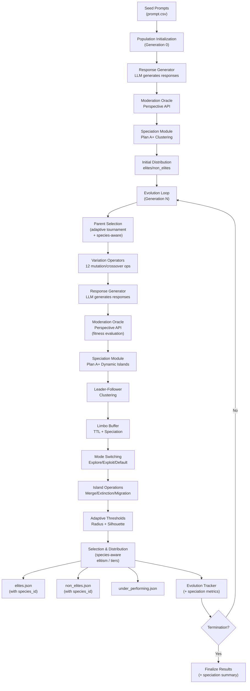
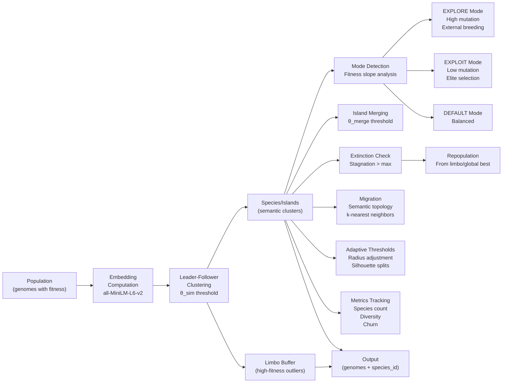

# System Architecture: Evolutionary Search for Toxicity in LLMs

## Overview

This system implements a genetic algorithm framework with **Plan A+ Dynamic Islands speciation** for evolving text prompts to elicit toxic responses from large language models, enabling comprehensive AI safety evaluation through adversarial prompt generation.

## Core Algorithm

### Evolutionary Process
The system uses a steady-state genetic algorithm with **semantic speciation** (Plan A+ Dynamic Islands) with the following components:

1. **Population Initialization**: Load initial prompts from CSV
2. **Parent Selection**: Adaptive tournament selection (can be species-aware)
3. **Variation**: Apply 12 different operators to generate offspring
4. **Response Generation**: LLM generates responses to evolved prompts
5. **Fitness Evaluation**: Score responses using Google Perspective API (toxicity)
6. **Speciation** (Plan A+): Semantic clustering into species/islands with dynamic adaptation
7. **Selection**: Distribute offspring into elite/non-elite/under-performing categories (species-aware)
8. **Termination**: Stop when convergence criteria are met

### Mathematical Framework

**Fitness Function**:
```
f(x) = toxicity_score(response to prompt x) ∈ [0, 1]
```

The fitness function evaluates toxicity in the LLM's response, not the prompt itself.

**Threshold Calculations**:
```
elite_threshold = max_toxicity × (100 - elite_percentage) / 100
removal_threshold = max_toxicity × removal_percentage / 100
```

## System Architecture

### High-Level Flow



### Detailed Speciation Flow



## Component Architecture

### Evolution Engine
Core evolution logic implementing the genetic algorithm. Manages the evolutionary cycle, coordinates operator application, and maintains population state throughout the evolution process.

### Parent Selector
Adaptive parent selection mechanism that adjusts selection strategy based on evolution progress and fitness landscape.

**Selection Modes**:
| Mode | Parents | Trigger |
|------|---------|---------|
| **DEFAULT** | 1 elite + 1 non-elite | First `m` generations |
| **EXPLORE** | 1 elite + 2 non-elites | Stagnation > `m` generations |
| **EXPLOIT** | 2 elites + 1 non-elite | Fitness slope < 0 |

### Variation Operators (12 Total)

#### Mutation Operators (10)
1. **Informed Evolution**: LLM-guided evolution using top performers
2. **Masked Language Model**: Contextual word substitution
3. **Paraphrasing**: Semantic-preserving text transformation
4. **Back Translation**: Hindi roundtrip translation (other languages disabled for performance)
5. **Synonym Replacement**: Lexical substitution with POS awareness
6. **Antonym Replacement**: Lexical substitution with POS awareness
7. **Negation**: Logical operator insertion
8. **Concept Addition**: Semantic concept injection
9. **Typographical Errors**: Character-level noise injection
10. **Stylistic Mutation**: Writing style transformation

#### Crossover Operators (2)
1. **Semantic Similarity**: Crossbreeding based on semantic distance
2. **Semantic Fusion**: Hybrid prompt generation

### Response Generation
Generates responses from target LLMs using the evolved prompts. Supports multiple model architectures through a unified interface.

### Moderation Evaluation
Evaluates generated responses for toxicity using Google Perspective API. Provides comprehensive toxicity scoring across multiple dimensions.

### Population Management
Manages population state, handles I/O operations, and maintains population statistics. Supports both monolithic and split file formats for scalability.

### Plan A+ Speciation Module
Implements Dynamic Islands framework using Leader-Follower clustering with semantic embeddings to maintain diverse species (islands) that evolve independently.

**Key Components**:

1. **Embedding Computation**: L2-normalized 384-dim embeddings using `all-MiniLM-L6-v2`
2. **Leader-Follower Clustering**: Fitness-sorted assignment to species based on semantic distance
3. **Limbo Buffer**: Holding area for high-fitness outliers with TTL and speciation incubation
4. **Mode Switching**: Adaptive Explore/Exploit/Default modes based on fitness trends
5. **Island Operations**:
   - **Merging**: Combine similar islands when leaders are close (θ_merge)
   - **Extinction**: Remove stagnant islands and repopulate from limbo/global best
   - **Migration**: Transfer individuals between semantically similar islands
6. **Adaptive Thresholds**: Dynamic radius adjustment and silhouette-based splits
7. **Metrics Tracking**: Species count, diversity, churn, silhouette scores

**Integration Point**: After fitness evaluation (moderation), before distribution. Each genome receives a `species_id` field for species-aware operations.

**Mathematical Framework**:

**Semantic Distance**:
```
d_semantic(u, v) = 1 - cos(u, v) = 1 - (u · v)
```
where u, v are L2-normalized embeddings. Range: [0, 2]

**Clustering Thresholds**:
- `θ_sim`: Similarity threshold for species assignment (default: 0.4)
- `θ_merge`: Merge threshold, tighter than θ_sim (default: 0.2)

**Mode Switching**:
- **EXPLOIT**: Triggered when fitness slope > improvement_threshold (default: 0.01)
- **EXPLORE**: Triggered when fitness slope < decline_threshold (default: -0.001)
- **DEFAULT**: Balanced mode otherwise

**Complexity**: O(N × K × d) per generation where N = population size, K = number of species, d = embedding dimension (384)

## Generation-by-Generation Flow

### Generation 0 (Initialization)
1. Load seed prompts from `prompt.csv`
2. Generate responses using Response Generator (LLM)
3. Evaluate fitness using Moderation Oracle (Perspective API)
4. **Run Speciation**: Leader-Follower clustering creates initial species
5. Distribute into `elites.json` and `non_elites.json` (with `species_id` fields)
6. Calculate elite thresholds and population statistics

### Generation N (Evolution Loop)
For each generation:

1. **Evolution Phase**:
   - Load population from `elites.json` and `non_elites.json`
   - Parent Selection (adaptive tournament, optionally species-aware)
   - Apply Variation Operators (12 mutation/crossover operators)
   - Save variants to `temp.json`

2. **Response Generation**:
   - Generate LLM responses for all variants in `temp.json`
   - Update `temp.json` with generated responses

3. **Fitness Evaluation**:
   - Evaluate toxicity using Moderation Oracle (Perspective API)
   - Update `temp.json` with fitness scores (`toxicity`, `north_star_score`)

4. **Speciation Phase** (Plan A+):
   - **Embedding Computation**: Compute L2-normalized embeddings for all prompts
   - **Leader-Follower Clustering**: Assign genomes to species based on semantic similarity
   - **Limbo Management**: Update TTL, check for speciation events from limbo clusters
   - **Mode Switching**: Update island modes (Explore/Exploit/Default) based on fitness trends
   - **Island Merging**: Merge similar islands if leaders are close (θ_merge)
   - **Extinction & Repopulation**: Remove stagnant islands, repopulate from limbo/global best
   - **Migration**: Transfer individuals between semantically similar islands (every N generations)
   - **Adaptive Thresholds**: Adjust island radii, trigger splits based on silhouette scores
   - **Metrics Recording**: Track species count, diversity, churn, silhouette scores
   - Update all genomes in `temp.json` with `species_id` fields

5. **Distribution Phase**:
   - Calculate elite thresholds based on max toxicity
   - Distribute genomes to `elites.json`, `non_elites.json`, or archive
   - All genomes now have `species_id` for species-aware operations

6. **Tracking Phase**:
   - Update EvolutionTracker.json with generation metrics
   - Record speciation metrics (species count, events, diversity)
   - Update population statistics

7. **Termination Check**:
   - Check if max generations reached or threshold achieved
   - If not, loop back to step 1

### Data Flow

```
prompt.csv (seed)
    ↓
Generation 0: [Response Gen] → [Moderation] → [Speciation] → [Distribution]
    ↓
elites.json + non_elites.json (with species_id)
    ↓
Generation N: [Evolution] → [Response Gen] → [Moderation] → [Speciation] → [Distribution]
    ↓
elites.json + non_elites.json (updated with species_id)
    ↓
[Repeat until termination]
```

### Key Data Structures

**Genome Dictionary** (in JSON files):
```python
{
    "id": int,
    "prompt": str,
    "generated_text": str,
    "toxicity": float,  # Fitness score
    "north_star_score": float,
    "species_id": int,  # Added by speciation module
    "generation": int,
    "operator": str,
    "variant_type": str,
    # ... other metadata
}
```

**Species Structure** (in-memory):
```python
Species(
    id: int,
    leader: Individual,  # Highest fitness member
    members: List[Individual],
    mode: IslandMode,  # DEFAULT | EXPLORE | EXPLOIT
    radius: float,  # Adaptive similarity threshold
    stagnation_counter: int,
    fitness_history: List[float]
)
```

## Summary: Plan A+ Speciation Integration

### Benefits

1. **Diversity Preservation**: Semantic clustering maintains distinct evolutionary niches
2. **Parallel Search**: Multiple islands explore different regions of the fitness landscape simultaneously
3. **Adaptive Behavior**: Islands switch between Explore/Exploit modes based on local fitness trends
4. **Outlier Management**: Limbo buffer preserves high-fitness outliers that don't fit existing species
5. **Dynamic Adaptation**: Islands merge, split, and repopulate based on performance
6. **Semantic Coherence**: Migration only occurs between semantically similar islands

### Integration Status

✅ **Implemented**: All speciation components are complete and tested
⏳ **Pending**: Integration into `main.py` evolution loop (after fitness evaluation)

### Usage

Once integrated, speciation runs automatically each generation after fitness evaluation:

```python
from speciation import SpeciationModule, PlanAPlusConfig

# Initialize (once, before evolution loop)
speciation_module = SpeciationModule(PlanAPlusConfig())

# In generation loop, after fitness evaluation:
species, limbo = speciation_module.process_generation(
    temp_variants,  # List of genome dicts with fitness
    current_generation=generation_count
)

# Update genomes with species IDs
temp_variants = speciation_module.update_genomes_with_species(temp_variants)
```

### Configuration

Key parameters in `PlanAPlusConfig`:
- `theta_sim=0.4`: Similarity threshold for species assignment
- `theta_merge=0.2`: Merge threshold (tighter than theta_sim)
- `max_island_capacity=50`: Maximum individuals per island
- `limbo_ttl=10`: Generations before limbo individuals expire
- `migration_frequency=5`: Migrate every N generations
- `silhouette_threshold=0.5`: Trigger split if silhouette below this

See `src/speciation/config.py` for full configuration options.

## Summary: Plan A+ Speciation Integration

### Benefits

1. **Diversity Preservation**: Semantic clustering maintains distinct evolutionary niches
2. **Parallel Search**: Multiple islands explore different regions of the fitness landscape simultaneously
3. **Adaptive Behavior**: Islands switch between Explore/Exploit modes based on local fitness trends
4. **Outlier Management**: Limbo buffer preserves high-fitness outliers that don't fit existing species
5. **Dynamic Adaptation**: Islands merge, split, and repopulate based on performance
6. **Semantic Coherence**: Migration only occurs between semantically similar islands

### Integration Status

✅ **Implemented**: All speciation components are complete and tested
⏳ **Pending**: Integration into `main.py` evolution loop (after fitness evaluation)

### Usage

Once integrated, speciation runs automatically each generation after fitness evaluation:

```python
from speciation import SpeciationModule, PlanAPlusConfig

# Initialize (once, before evolution loop)
speciation_module = SpeciationModule(PlanAPlusConfig())

# In generation loop, after fitness evaluation:
species, limbo = speciation_module.process_generation(
    temp_variants,  # List of genome dicts with fitness
    current_generation=generation_count
)

# Update genomes with species IDs
temp_variants = speciation_module.update_genomes_with_species(temp_variants)
```

### Configuration

Key parameters in `PlanAPlusConfig`:
- `theta_sim=0.4`: Similarity threshold for species assignment
- `theta_merge=0.2`: Merge threshold (tighter than theta_sim)
- `max_island_capacity=50`: Maximum individuals per island
- `limbo_ttl=10`: Generations before limbo individuals expire
- `migration_frequency=5`: Migrate every N generations
- `silhouette_threshold=0.5`: Trigger split if silhouette below this

See `src/speciation/config.py` for full configuration options.

