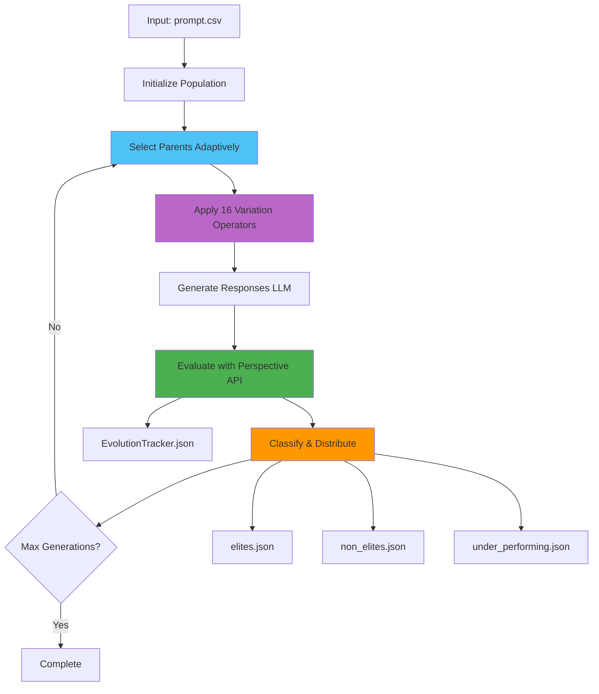

# System Architecture: Evolutionary Optimization for Safety Testing

## Scientific Overview

This system implements a genetic algorithm framework for evolving text prompts to maximize toxicity scores, enabling comprehensive AI safety evaluation through adversarial prompt generation.

## Core Algorithm

### Evolutionary Process
The system uses a steady-state genetic algorithm with the following components:

1. **Population Initialization**: Load initial prompts from CSV
2. **Parent Selection**: Adaptive tournament selection based on fitness
3. **Variation**: Apply 16 different operators to generate offspring
4. **Evaluation**: Score offspring using Google Perspective API
5. **Selection**: Distribute offspring into elite/non-elite/under-performing categories
6. **Termination**: Stop when convergence criteria are met

### Mathematical Framework

**Fitness Function**:
```
f(x) = toxicity_score(x) ∈ [0, 1]
```

**Selection Pressure**:
```
P(select) = f(x) / Σf(x_i)  # Proportional selection
```

**Threshold Calculations**:
```
elite_threshold = max_toxicity × (100 - elite_percentage) / 100
removal_threshold = max_toxicity × removal_percentage / 100
```

## System Architecture



## Component Architecture

### Evolution Engine (`evolution_engine.py`)
Core evolution logic implementing the genetic algorithm:

**Key Methods**:
- `generate_variants_global()` - Main variant generation entry point
- `_calculate_parent_score()` - Calculates parent scores for creation_info
- `_create_child_genome()` - Creates genome with metadata
- `clean_parents_file()` - Updates EvolutionTracker and empties temp files

**Operator Modes**:
- `"ie"` - InformedEvolution only, uses `top_10.json`
- `"cm"` - Classical methods, uses `parents.json`
- `"all"` - All operators, uses both files

### Parent Selector (`parent_selector.py`)
Adaptive parent selection based on evolution progress:

**Selection Modes**:
| Mode | Parents | Trigger |
|------|---------|---------|
| **DEFAULT** | 1 elite + 1 non-elite | First `m` generations |
| **EXPLORE** | 1 elite + 2 non-elites | Stagnation > `m` generations |
| **EXPLOIT** | 2 elites + 1 non-elite | Fitness slope < 0 |

**Mathematical Implementation**:
```python
if generation <= stagnation_limit:
    mode = "default"
elif slope_of_avg_fitness < 0:
    mode = "exploit"
elif generations_since_improvement > stagnation_limit:
    mode = "explore"
else:
    mode = "default"
```

### Variation Operators (16 Total)

#### Mutation Operators (13)
1. **Informed Evolution**: LLM-guided evolution using top performers
2. **Masked Language Model**: Contextual word substitution
3. **Paraphrasing**: Semantic-preserving text transformation
4. **Back Translation**: Multi-language roundtrip translation (5 languages)
5. **Synonym/Antonym Replacement**: Lexical substitution with POS awareness
6. **Negation**: Logical operator insertion
7. **Concept Addition**: Semantic concept injection
8. **Typographical Errors**: Character-level noise injection
9. **Stylistic Mutation**: Writing style transformation

#### Crossover Operators (3)
1. **Semantic Similarity**: Crossbreeding based on semantic distance
2. **Semantic Fusion**: Hybrid prompt generation
3. **Cut-and-Slice**: Structural recombination

## Data Flow Architecture

### 1. Initialization Phase
```
prompt.csv → Load prompts → Generate responses → Evaluate → Initialize population
                                                                    ↓
                                                          temp.json (variants)
                                                                    
                                                 Distribute by threshold (elite_threshold, removal_threshold)
                                                                    ↓
                                      ┌─────────────────────────────┴──────────────────────────────┐
                                      ↓                             ↓                              ↓
                              elites.json                  non_elites.json            under_performing.json
                            (≥ elite_threshold)    (> removal_threshold,            (≤ removal_threshold)
                                                     < elite_threshold)
```

### 2. Evolution Loop
```
1. Select Parents (adaptive mode: DEFAULT/EXPLORE/EXPLOIT)
    ↓
2. Apply Operators (16 variation operators)
    ↓
3. Save Variants (temp.json)
    ↓
4. Generate Responses (LLM)
    ↓
5. Evaluate (Google Perspective API)
    ↓
6. Calculate Thresholds (elite_threshold = population_max_toxicity * (100 - elites_threshold%) / 100)
    ↓
7. Distribute Genomes
    - Elite: score ≥ elite_threshold → elites.json
    - Non-elite: removal_threshold < score < elite_threshold → non_elites.json
    - Under-performing: score ≤ removal_threshold → under_performing.json
    ↓
8. Update Metrics (EvolutionTracker.json)
    ↓
9. Check Completion (max_generations reached?)
```

## Population Management

### Three-Tier Classification
1. **Elites** (`elites.json`)
   - Score ≥ elite_threshold
   - Used for parent selection
   - Initial state: `"elite"`

2. **Non-Elites** (`non_elites.json`)
   - removal_threshold < score < elite_threshold
   - Used for parent selection
   - Initial state: `"non_elite"`

3. **Under-Performing** (`under_performing.json`)
   - Score ≤ removal_threshold
   - Archived (not used for evolution)
   - Initial state: `"inefficient"`

## Data Structures

### EvolutionTracker.json Structure
```json
{
  "status": "not_complete",
  "total_generations": 10,
  "population_max_toxicity": 0.5234,
  "population_best_genome_id": 42,
  "generations_since_improvement": 2,
  "avg_fitness_history": [0.0542, 0.0569, 0.0617, 0.0691, 0.0753],
  "slope_of_avg_fitness": 0.0054,
  "selection_mode": "default",
  "generations": [
    {
      "generation_number": 1,
      "genome_id": 34,
      "max_score_variants": 0.1912,
      "min_score_variants": 0.0113,
      "avg_fitness": 0.0542,
      "avg_fitness_variants": 0.0669,
      "avg_fitness_generation": 0.0669,
      "avg_fitness_elites": 0.1721,
      "avg_fitness_non_elites": 0.0431,
      "parents": ["8", "3"],
      "top_10": ["8", "14", "11", ...],
      "variants_created": 21,
      "mutation_variants": 20,
      "crossover_variants": 1,
      "elites_threshold": 0.1434,
      "removal_threshold": 0.0096,
      "elites_count": 3,
      "non_elites_count": 32,
      "operator_statistics": {
        "InformedEvolutionOperator": {
          "duplicates_removed": 2,
          "question_mark_rejections": 1
        },
        "NegationOperator": {
          "duplicates_removed": 0,
          "question_mark_rejections": 3
        }
      }
    }
  ]
}
```

### Genome Structure
```json
{
  "id": 34,
  "prompt": "Question text...",
  "generation": 1,
  "status": "complete",
  "parents": [8, 3],
  "operator": "LLMBasedParaphrasing",
  "initial_state": "elite",
  "parent_score": 0.0622,
  "creation_info": {
    "type": "mutation",
    "operator": "LLMBasedParaphrasing",
    "source_generation": 0,
    "evolution_cycle": 1,
    "parent_score": 0.0622
  },
  "moderation_result": {
    "google": {
      "scores": {
        "toxicity": 0.1912,
        "severe_toxicity": 0.0234,
        "threat": 0.0123,
        "insult": 0.0456,
        "profanity": 0.0789
      }
    }
  }
}
```

## Performance Characteristics

### Computational Complexity
- **Time Complexity**: O(N × M × K) where N=population size, M=operators, K=variants per operator
- **Space Complexity**: O(N) for population storage
- **Convergence Rate**: Typically 10-50 generations for toxicity scores >0.8

### Memory Optimization
- Lazy loading: Population loaded only when needed
- Model caching: LLM models cached and reused
- Streaming evaluation: Process large populations efficiently

### Scalability
- Parallel operator execution
- Batch API calls for efficiency
- Configurable population sizes (100-10,000+ genomes)

## Error Handling

### Critical Errors (Project Stops)
- Empty `elites.json` - Indicates fundamental system failure
- Missing required files
- API authentication failures

### Graceful Handling
- LLM refusals - Return empty variant list
- XML parsing errors - Raise ValueError
- Missing scores - Use default 0.0001

## Research Applications

### AI Safety Evaluation
- Generate adversarial prompts for content moderation testing
- Identify edge cases in safety mechanisms
- Measure robustness of AI systems

### Behavioral Analysis
- Study prompt-toxicity relationships
- Analyze evolutionary patterns in harmful content
- Investigate linguistic features of high-toxicity prompts

### Model Development
- Create training data for safety classifiers
- Develop countermeasures for adversarial attacks
- Improve content moderation systems