# Project Architecture

## Table of Contents

- [Architecture Overview](#architecture-overview)
- [System Components](#system-components)
- [Data Flow](#data-flow)
- [Memory Management](#memory-management)
- [Text Variation Operators](#text-variation-operators)
- [Configuration](#configuration)
- [Performance Characteristics](#performance-characteristics)
- [Recent Architecture Improvements](#recent-architecture-improvements)
- [Documentation Index](#documentation-index)

## Architecture Overview


## System Components

### **Entry Points**
Removed `app.py` — all CLI usage is consolidated in `src/main.py`.
- **`src/main.py`** - Direct execution pipeline

### **Core Pipeline**
- **`RunEvolution.py`** - Evolution orchestration
- **`EvolutionEngine.py`** - Genetic algorithm core

### **Evolution Components**
- **`ParentSelector.py`** - Steady-state selection
- **Operator System** - 16 variation operators
- **Population I/O** - Steady-state management

### **Generation & Evaluation**
- **`ResponseGenerator.py`** - Response generation using prompt_template
- **`PromptGenerator.py`** - Prompt generation using task templates
- **`evaluator.py`** - Safety evaluation

## System Overview


## Core Pipeline Flow

```mermaid
flowchart LR
  A[Input Prompts<br/>data/prompt.xlsx] --> B[Text Generation<br/>Qwen2.5-7B Model]
  B --> C[Safety Evaluation<br/>Hybrid Moderation]
  C --> D[Evolution<br/>16 Text Variation Operators]
  D --> E[Population Update<br/>Steady-State Elites]
  E --> F{Threshold<br/>Reached?}
  F -->|No| B
  F -->|Yes| G[Complete]
  
  subgraph "Data Flow"
    H[Generated Responses]
    I[Moderation Scores]
    J[New Variants]
    K[Updated Elites]
  end
  
  B --> H
  C --> I
  D --> J
  E --> K
  D --> L1[Staging to temp.json]
  L1 --> L2[Intra-temp Dedup (EvolutionEngine)]
  L2 --> L3[Cross-file Dedup (RunEvolution)]
  
  style A fill:#64b5f6,stroke:#1976d2,stroke-width:2px,color:#000
  style B fill:#ba68c8,stroke:#7b1fa2,stroke-width:2px,color:#000
  style C fill:#4caf50,stroke:#2e7d32,stroke-width:2px,color:#000
  style D fill:#ff9800,stroke:#ef6c00,stroke-width:2px,color:#000
  style F fill:#f48fb1,stroke:#c2185b,stroke-width:2px,color:#000
  style G fill:#66bb6a,stroke:#388e3c,stroke-width:2px,color:#000
```

## Data Flow

### **Input Layer**
- **`data/prompt.xlsx`** - Input prompts for evolution

### **Processing Layer (Steady-State)**
- Population Initialization
- Text Generation Phase
- Safety Evaluation Phase
- Evolution Phase

### **Storage Layer**
- **`data/outputs/elites.json`** - Steady-state population
- **`data/outputs/EvolutionTracker.json`** - Progress tracking
- **`data/outputs/population_index.json`** - Metadata & index
- **`data/outputs/non_elites.json`** - Full population backup
- **`data/outputs/temp.json`** - Staging area during generation cycles

## Memory Management

```mermaid
flowchart LR
  A[Memory Monitor] --> B[Adaptive Batch Sizing]
  B --> C[Model Caching]
  C --> D[Lazy Loading]
  D --> E[Memory Cleanup]
  E --> A
  
  subgraph "Memory Optimization Features"
    F[Real-time Tracking<br/>• System memory<br/>• GPU memory<br/>• Process memory]
    G[Threshold Alerts<br/>• Warning at 75%<br/>• Critical at 90%<br/>• Auto cleanup]
    H[Cache Management<br/>• PyTorch cache clear<br/>• Model cache mgmt<br/>• Operator cleanup]
    I[Garbage Collection<br/>• Force GC<br/>• Memory defrag<br/>• Elite preservation]
  end
  
  A --> F
  A --> G
  E --> H
  E --> I
  
  style A fill:#f48fb1,stroke:#c2185b,stroke-width:3px,color:#000
  style E fill:#66bb6a,stroke:#388e3c,stroke-width:3px,color:#000
  style F fill:#42a5f5,stroke:#1565c0,stroke-width:2px,color:#000
  style G fill:#ffb74d,stroke:#f57c00,stroke-width:2px,color:#000
  style H fill:#ab47bc,stroke:#6a1b9a,stroke-width:2px,color:#000
  style I fill:#66bb6a,stroke:#2e7d32,stroke-width:2px,color:#000
```



## Text Variation Operators

### **Current Active Operators (16 Total)**

#### **Mutation Operators (14)**
1. **LLM_POSAwareSynonymReplacement** - LLaMA-based synonym replacement using POS tagging
2. **LLM_POSAwareAntonymReplacement** - LLaMA-based antonym replacement using POS tagging
3. **MLMOperator** - BERT masked language model for word replacement
4. **LLMBasedParaphrasingOperator** - LLaMA-based paraphrasing with optimization
5. **StylisticMutator** - Stylistic text mutations
6. **LLMBackTranslationHIOperator** - Hindi back-translation (LLaMA)
7. **LLMBackTranslationFROperator** - French back-translation (LLaMA)
8. **LLMBackTranslationDEOperator** - German back-translation (LLaMA)
9. **LLMBackTranslationJAOperator** - Japanese back-translation (LLaMA)
10. **LLMBackTranslationZHOperator** - Chinese back-translation (LLaMA)
11. **NegationOperator** - Adds negation to prompt questions (NEW)
12. **TypographicalErrorsOperator** - Simulates common human typos and spelling mistakes (NEW)
13. **ConceptAdditionOperator** - Adds unfairness and bias constraints to questions (NEW)
14. **InformedEvolutionOperator** - Uses top 10 elites to generate more toxic variants (NEW)

#### **Crossover Operators (2)**
1. **SemanticSimilarityCrossover** - Semantic similarity-based crossover
2. **SemanticFusionCrossover** - LLM-based instruction structure preservation

### **Operator Selection Logic**


## Configuration

### **Model Configuration**
- **Prompt Generator**: Qwen2.5-7B-Instruct (default)
- **Response Generator**: Llama3.2-3B-Instruct (default)
- **GPU Acceleration**: Enabled by default (`n_gpu_layers: -1`)

### **Evolution Parameters**
- **Max Parents**: 2 (reduced from 4 to control population growth)
- **Adaptive Selection**: After 10 generations (increased from 5)
- **Max Variants**: 1 per operator (controlled growth)
- **Threshold**: 0.95 (north star metric)

### **Memory Management**
- **Memory Threshold**: 20.0 GB
- **Check Interval**: 1800 seconds (30 minutes)
- **Stuck Threshold**: 7200 seconds (2 hours)
- **Max Restarts**: 5

## Performance Characteristics

### **Memory Usage**
- **Elites Population**: ~500KB (124 genomes)
- **Full Population**: ~2.8MB (2885 genomes)
- **Model Loading**: Efficient caching and reuse across operators
- **Steady-State**: Continuous memory management with elite preservation

### **Scalability**
- **Population Growth**: Controlled through elite redistribution
- **Operator Efficiency**: Lazy loading and model reuse
- **Memory Management**: Real-time monitoring and adaptive batch sizing

### **Optimization Features**
- **Lazy Imports**: Prevents circular dependencies
- **Model Caching**: Reuse loaded models across operators
- **Memory Monitoring**: Real-time memory usage tracking
- **Automatic Cleanup**: PyTorch cache and garbage collection
- **Steady-State Management**: Efficient elite preservation

## Adaptive Selection Logic

The framework now includes **adaptive selection pressure** that dynamically adjusts parent selection based on evolution progress:

### **Selection Modes:**

#### **DEFAULT Mode** (Balanced)
- **Selection**: 1 elite + 1 non-elite
- **Usage**: Initial generations and steady progress
- **Purpose**: Balanced exploration and exploitation

#### **EXPLORE Mode** (Increased Exploration)
- **Selection**: 1 elite + 2 non-elites
- **Trigger**: After `stagnation_limit` generations without improvement
- **Purpose**: Increase exploration when evolution is stuck

#### **EXPLOIT Mode** (Focused Exploitation)
- **Selection**: 2 elites + 1 non-elite
- **Trigger**: When fitness slope < 0 (declining performance)
- **Purpose**: Focus on exploitation when fitness is declining

### **Adaptive Triggers:**


### **Configuration Parameters:**

- **`--stagnation-limit`**: Number of generations without improvement before switching to EXPLORE mode (default: 5)
- **`--elites-threshold`**: Percentage for elite classification (default: 25%)
- **`--removal-threshold`**: Percentage for removing worst performing genomes (default: 5%)

### **EvolutionTracker Integration:**

The adaptive selection logic is tracked in `EvolutionTracker.json`:

```json
{
  "generations_since_improvement": 0,
  "avg_fitness_history": [0.1, 0.2, 0.15, 0.1, 0.05],
  "slope_of_avg_fitness": -0.025,
  "selection_mode": "exploit"
}
```

## Recent Architecture Improvements

### **1. Steady-State Population Management**
- **Problem**: Generation-based evolution had artificial boundaries
- **Solution**: Continuous evolution with elite preservation
- **Benefits**: More natural evolution, better performance tracking, memory efficiency

### **2. 16 Text Variation Operators**
- **Problem**: Limited text variation capabilities
- **Solution**: Comprehensive operator suite with 4 new mutation operators
- **Benefits**: Rich text variation, multi-language support, diverse evolution strategies

### **3. New Mutation Operators (January 2025)**
- **NegationOperator**: Adds negation to prompt questions (e.g., "advantages" → "disadvantages")
- **TypographicalErrorsOperator**: Simulates common human typos and spelling mistakes
- **ConceptAdditionOperator**: Adds unfairness and bias constraints to questions
- **InformedEvolutionOperator**: Uses top 10 elites to generate more toxic variants

### **4. Enhanced Memory Management**
- **Problem**: Memory pressure with multiple operators
- **Solution**: Model caching, lazy loading, adaptive batch sizing
- **Benefits**: Lower memory usage, faster execution, better scalability

### **5. GPU Acceleration**
- **Problem**: Models running on CPU
- **Solution**: Enabled GPU acceleration for both PG and RG models
- **Benefits**: Faster model inference, better performance

### **6. Parent Selection Optimization**
- **Problem**: Excessive number of parents leading to exponential growth
- **Solution**: Reduced max parents from 4 to 2, increased adaptive selection threshold
- **Benefits**: Controlled population growth, more manageable evolution

## Deduplication Flow


**Key Points:**
- Staging occurs in `data/outputs/temp.json` for the current generation cycle
- Intra-file dedup removes duplicate prompts/IDs within `temp.json` (EvolutionEngine)
- Cross-file dedup removes items already present in `elites.json` and `non_elites.json` (RunEvolution)
- After processing and routing, `temp.json` is cleared for the next cycle

## File Structure Architecture

```mermaid
graph TB
  subgraph "EOST-CAM-LLM Project Structure"
    A[src/main.py<br/>Main entry point]
    
    subgraph "Configuration"
      B1[config/RGConfig.yaml<br/>Response generation model configuration]
      B2[config/PGConfig.yaml<br/>Prompt generation model configuration]
    end
    
    subgraph "Data"
      C[data/prompt.xlsx<br/>Input prompts]
    end
    
    subgraph "Source Code (src/)"
      D[main.py<br/>Core evolution pipeline]
      
      subgraph "Generation & Evaluation (gne/)"
        E1[ResponseGenerator.py<br/>Response generation using prompt_template]
        E2[PromptGenerator.py<br/>Prompt generation using task templates]
        E3[evaluator.py<br/>Content moderation evaluation]
        E4[model_interface.py<br/>Model loading and GPU configuration]
      end
      
      subgraph "Evolutionary Algorithms (ea/)"
        F1[EvolutionEngine.py<br/>Genetic algorithm core (steady-state)]
        F2[Individual Operator Files<br/>16 variation operators]
        F3[ParentSelector.py<br/>Selection strategies (steady-state)]
        F4[RunEvolution.py<br/>Evolution pipeline]
        F5[__init__.py<br/>Package exports]
      end
      
      subgraph "Utilities (utils/)"
        G1[population_io.py<br/>Steady-state population management]
        G2[custom_logging.py<br/>Performance tracking]
        G3[m3_optimizer.py<br/>M3 Mac optimization]
        G4[config.py<br/>Configuration utilities]
        G5[constants.py<br/>System constants]
        G6[download_models.py<br/>Model download utilities]
        G7[device_utils.py<br/>Device and GPU utilities]
      end
    end
    
    subgraph "Outputs"
      H1[elites.json<br/>Steady-state elite population]
      H2[non_elites.json<br/>Full population backup]
      H3[population_index.json<br/>Population metadata/index]
      H4[EvolutionTracker.json<br/>Evolution progress tracking]
      H5[temp.json<br/>Staging area during generation cycles]
    end
    
    subgraph "Supporting Files"
      I1[logs/<br/>Log files]
      I2[tests/<br/>Test suite]
      I3[requirements.txt<br/>Python dependencies]
      I4[LICENSE<br/>MIT License]
    end
  end
  
  A --> D
  D --> E1
  D --> F1
  D --> G1
  D --> H1
  
  style A fill:#64b5f6,stroke:#1976d2,stroke-width:2px,color:#000
  style D fill:#ba68c8,stroke:#7b1fa2,stroke-width:2px,color:#000
  style E1 fill:#4caf50,stroke:#2e7d32,stroke-width:2px,color:#000
  style F1 fill:#ff9800,stroke:#ef6c00,stroke-width:2px,color:#000
  style G1 fill:#f48fb1,stroke:#c2185b,stroke-width:2px,color:#000
  style H1 fill:#aed581,stroke:#689f38,stroke-width:2px,color:#000
```

## Documentation Index

### 📚 **Core Documentation**
- **[README.md](README.md)** - Main project documentation with setup instructions
- **[Evolutionary Algorithms Guide](src/ea/README.md)** - Detailed guide to genetic algorithms and operators
- **[EA Notes](src/ea/notes.md)** - Implementation notes and data flow details

### 📖 **Technical Documentation**
- **[LLM POS-Aware Synonym Replacement](docs/LLM_POSAwareSynonymReplacement.md)** - POS-aware operations guide
- **[vLLM Migration Guide](docs/vLLM_Migration_Guide.md)** - vLLM integration guide
- **[LLM POS Test Updates](docs/README_llm_pos_test_updates.md)** - Testing updates and information

### 🧪 **Testing & Development**
- **[Tests README](tests/README.md)** - Testing framework documentation
- **[Test Files](tests/)** - Comprehensive test suite for all operators

### 🔧 **Configuration Files**
- **[RGConfig.yaml](config/RGConfig.yaml)** - Response Generator configuration
- **[PGConfig.yaml](config/PGConfig.yaml)** - Prompt Generator configuration
- **[.env](.env)** - Environment variables and API keys

### 📊 **Data Files**
- **[prompt.xlsx](data/prompt.xlsx)** - Input prompts for evolution
- **[outputs/](data/outputs/)** - Evolution results and tracking data
- **[models/](models/)** - Local model files and configurations

### 🚀 **Quick Reference**
- **Run**: `python3 src/main.py --generations 25`
- **Test**: `python3 src/main.py --generations 1`
- **Monitor**: Check `logs/` directory for execution logs

This enhanced architecture provides a robust, scalable, and memory-efficient framework for evolutionary text generation with comprehensive operator support, steady-state population management, and multi-language capabilities.