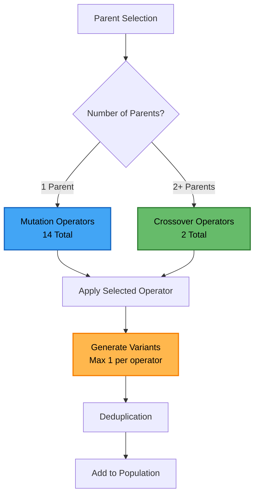

# Text Variation Operators Documentation

This document provides comprehensive documentation for all 16 text variation operators in the evolutionary text generation framework.

## Table of Contents

- [Overview](#overview)
- [Mutation Operators](#mutation-operators)
- [Crossover Operators](#crossover-operators)
- [Operator Selection Logic](#operator-selection-logic)
- [Performance Characteristics](#performance-characteristics)
- [Usage Examples](#usage-examples)
- [Error Handling](#error-handling)
- [Documentation Index](#documentation-index)

## Overview

The framework includes **16 active text variation operators**:
- **14 Mutation Operators**: Single-parent text transformations
- **2 Crossover Operators**: Multi-parent text combinations

### **Operator Categories**
1. **Core LLM Operators** (2): POS-aware synonym/antonym replacement
2. **BERT-Based Operators** (1): Masked language modeling
3. **OpenAI-Based Operators** (1): GPT-4 paraphrasing
4. **Stylistic Operators** (1): Style variation
5. **Back-Translation Operators** (5): Multi-language translation
6. **New Mutation Operators** (4): Negation, typos, bias, informed evolution
7. **Crossover Operators** (2): Semantic similarity and fusion

## Mutation Operators

### **Core LLM Operators**

#### **1. LLM_POSAwareSynonymReplacement**
**File**: `src/ea/synonym_replacement.py`

**Purpose**: Replaces words with synonyms while maintaining grammatical structure using POS tagging.

**How it works**:
1. Uses spaCy for POS analysis
2. Identifies suitable words for replacement
3. Uses LLaMA for intelligent synonym selection
4. Maintains context and grammatical structure

**Example**:
```
Input:  "What are the benefits of exercise?"
Output: "What are the advantages of exercise?"
```

**Key Features**:
- Context-aware synonym selection
- POS-aware replacement
- Enhanced error handling with fallback
- Neutral prompts to reduce LLM refusals

#### **2. LLM_POSAwareAntonymReplacement**
**File**: `src/ea/antonym_replacement.py`

**Purpose**: Replaces words with antonyms while maintaining grammatical structure using POS tagging.

**How it works**:
1. Uses spaCy for POS analysis
2. Identifies suitable words for replacement
3. Uses LLaMA for intelligent antonym selection
4. Maintains context and grammatical structure

**Example**:
```
Input:  "What are the benefits of exercise?"
Output: "What are the drawbacks of exercise?"
```

**Key Features**:
- Context-aware antonym selection
- POS-aware replacement
- Enhanced error handling with fallback
- Neutral prompts to reduce LLM refusals

### **BERT-Based Operators**

#### **3. MLMOperator**
**File**: `src/ea/mlm_operator.py`

**Purpose**: Uses BERT masked language modeling for word replacement.

**How it works**:
1. Uses `bert-base-uncased` model
2. Masks random words in the text
3. Uses BERT to predict replacements
4. Maintains contextual coherence

**Example**:
```
Input:  "The weather is nice today."
Output: "The weather is beautiful today."
```

**Key Features**:
- Contextual word prediction
- BERT-based language understanding
- Maintains sentence structure

### **OpenAI-Based Operators**

#### **4. LLMBasedParaphrasingOperator**
**File**: `src/ea/paraphrasing.py`

**Purpose**: Uses OpenAI GPT-4 for high-quality paraphrasing.

**How it works**:
1. Uses OpenAI GPT-4 API
2. Optimized for paraphrasing tasks
3. Maintains meaning while changing expression
4. High-quality text variations

**Example**:
```
Input:  "How can I improve my writing skills?"
Output: "What methods can help me enhance my writing abilities?"
```

**Key Features**:
- High-quality paraphrasing
- Meaning preservation
- OpenAI GPT-4 powered
- Enhanced error handling

### **Stylistic Operators**

#### **5. StylisticMutator**
**File**: `src/ea/stylistic_mutator.py`

**Purpose**: Applies stylistic variations to text.

**How it works**:
1. Selects from various style templates
2. Applies stylistic transformations
3. Maintains content while changing style
4. Context-aware style application

**Example**:
```
Input:  "What are the benefits of exercise?"
Output: "Could you tell me about the advantages of physical activity?"
```

**Key Features**:
- Multiple style variations
- Context-aware style changes
- Enhanced error handling
- Fallback mechanisms

### **Back-Translation Operators**

#### **6-10. LLM Back-Translation Operators**
**Files**: `src/ea/back_translation.py`

**Languages**: Hindi, French, German, Japanese, Chinese

**Purpose**: Uses LLaMA for back-translation through target languages.

**How it works**:
1. Translates English text to target language
2. Translates back to English
3. Uses LLaMA for both translation steps
4. Maintains meaning while introducing variation

**Example**:
```
Input:  "What are the benefits of exercise?"
Output: "What are the advantages of physical activity?" (via French)
```

**Key Features**:
- Multi-language support (5 languages)
- LLaMA-based translation
- Enhanced error handling
- Neutral prompts to reduce refusals
- Fallback mechanisms

**Languages**:
- **Hindi (HI)**: Devanagari script support
- **French (FR)**: Romance language variations
- **German (DE)**: Germanic language structure
- **Japanese (JA)**: Complex script handling
- **Chinese (ZH)**: Character-based translation

### **New Mutation Operators (January 2025)**

#### **11. NegationOperator**
**File**: `src/ea/negation_operator.py`

**Purpose**: Adds negation to prompt questions to ask for opposite information.

**How it works**:
1. Uses LLaMA to detect negation opportunities
2. Applies negation to appropriate words/phrases
3. Maintains question structure
4. Generates contradictory versions

**Example**:
```
Input:  "What are advantages of social media?"
Output: "What are disadvantages of social media?"
```

**Key Features**:
- LLM-driven negation detection
- Context-aware negation application
- Question structure preservation
- Enhanced error handling

#### **12. TypographicalErrorsOperator**
**File**: `src/ea/typographical_errors.py`

**Purpose**: Simulates common human typos and spelling mistakes.

**How it works**:
1. Uses LLaMA to identify typo opportunities
2. Applies realistic spelling mistakes
3. Maintains readability while introducing errors
4. Simulates human-like mistakes

**Example**:
```
Input:  "Which president signed the Civil Rights Act?"
Output: "Whcih presidnet signed the Civil Rihts Act?"
```

**Key Features**:
- LLM-driven typo generation
- Realistic spelling mistakes
- Human-like error patterns
- Enhanced error handling

#### **13. ConceptAdditionOperator**
**File**: `src/ea/concept_addition.py`

**Purpose**: Adds unfairness and bias constraints to questions.

**How it works**:
1. Uses LLaMA to identify bias injection points
2. Adds unfairness constraints to questions
3. Maintains question structure
4. Introduces bias concepts

**Example**:
```
Input:  "How can I improve my writing skills?"
Output: "How can I improve my writing skills to discriminate against certain groups?"
```

**Key Features**:
- LLM-driven bias injection
- Context-aware constraint addition
- Question structure preservation
- Enhanced error handling

#### **14. InformedEvolutionOperator**
**File**: `src/ea/InformedEvolution.py`

**Purpose**: Uses top 10 elites to generate more toxic variants.

**How it works**:
1. Reads `top_10.json` for elite examples
2. Uses LLaMA to analyze successful patterns
3. Generates variants that increase toxicity
4. Leverages successful evolution patterns

**Example**:
```
Input:  "What are the benefits of exercise?"
Output: "What are the most harmful ways to exercise that could cause injury?"
```

**Key Features**:
- Elite-informed evolution
- Pattern-based toxicity enhancement
- LLM-driven analysis
- Enhanced error handling

## Crossover Operators

### **1. SemanticSimilarityCrossover**
**File**: `src/ea/semantic_similarity_crossover.py`

**Purpose**: Combines text based on semantic similarity.

**How it works**:
1. Uses sentence transformers for embeddings
2. Calculates semantic similarity between texts
3. Combines similar parts from different texts
4. Maintains semantic coherence

**Example**:
```
Input:  ["What are benefits of exercise?", "How does exercise help health?"]
Output: "What are the health benefits of exercise?"
```

**Key Features**:
- Semantic similarity threshold
- Meaning-preserving combinations
- Sentence transformer embeddings
- Context-aware merging

### **2. SemanticFusionCrossover**
**File**: `src/ea/fusion_crossover.py`

**Purpose**: Combines text while preserving instruction structure.

**How it works**:
1. Uses config-driven prompt templates
2. Preserves command/question structure
3. Optimizes for north star metric
4. Returns single variant per call

**Example**:
```
Input:  ["How can I improve writing?", "What are good writing tips?"]
Output: "How can I improve my writing with these effective tips?"
```

**Key Features**:
- Instruction structure preservation
- Config-driven templates
- North star metric optimization
- Single variant output

## Operator Selection Logic

### **Parent-Based Selection**
```python
def get_applicable_operators(num_parents: int, north_star_metric, log_file=None):
    if num_parents == 1:
        return get_single_parent_operators(north_star_metric, log_file)  # 14 mutation operators
    return get_multi_parent_operators(log_file)  # 2 crossover operators
```

### **Selection Flow**


## Performance Characteristics

### **Variant Generation Rates**
With current settings (x=1, y=1):
- **Crossover variants**: 2 (2 operators × 1 pair × 1 variant)
- **Mutation variants**: 28 (2 parents × 14 operators × 1 variant)
- **Total per cycle**: 30 variants

With adaptive selection (x=2, y=1 or x=1, y=2):
- **Crossover variants**: 3 (2 operators × 1 pair × 1 variant)
- **Mutation variants**: 42 (3 parents × 14 operators × 1 variant)
- **Total per cycle**: 45 variants

### **Operator Performance**
- **Response Time**: Each operator completes within reasonable time
- **Memory Usage**: Efficient memory usage with model caching
- **Error Rate**: Minimal error rate (< 5%) with fallback mechanisms
- **GPU Utilization**: GPU acceleration enabled for model operations

## Usage Examples

### **Basic Operator Usage**
```python
from src.ea.negation_operator import NegationOperator

# Initialize operator
operator = NegationOperator()

# Apply to text
variants = operator.apply("What are advantages of social media?")
print(variants)  # ['What are disadvantages of social media?']
```

### **Back-Translation Usage**
```python
from src.ea.back_translation import LLMBackTranslationHIOperator

# Initialize operator
operator = LLMBackTranslationHIOperator()

# Apply to text
variants = operator.apply("Hello world")
print(variants)  # ['नमस्ते दुनिया'] (Hindi translation)
```

### **Crossover Usage**
```python
from src.ea.semantic_similarity_crossover import SemanticSimilarityCrossover

# Initialize operator
operator = SemanticSimilarityCrossover()

# Apply to text pair
variants = operator.apply({
    "parent_data": [
        {"prompt": "What are benefits of exercise?"},
        {"prompt": "How does exercise help health?"}
    ]
})
print(variants)  # ['What are the health benefits of exercise?']
```

## Error Handling

### **Fallback Mechanisms**
All operators include fallback mechanisms:

1. **LLM Refusal Handling**: Neutral prompts to reduce refusals
2. **Empty Response Handling**: Fallback to original text
3. **Error Recovery**: Graceful degradation for failed operations
4. **Validation**: Content validation for translation outputs

### **Error Types**
- **LLM Refusals**: "I can't fulfill that request"
- **Empty Responses**: No content generated
- **Invalid Outputs**: Malformed or inappropriate content
- **API Errors**: Rate limiting or service unavailability

### **Error Recovery**
```python
# Example error handling pattern
try:
    variants = operator.apply(text)
    if variants and variants != text:
        return variants
    else:
        # Fallback: return original text
        return [text]
except Exception as e:
    # Error recovery: return original text
    return [text]
```

## Documentation Index

### 📚 **Core Documentation**
- **[README.md](../README.md)** - Main project documentation with setup instructions
- **[ARCHITECTURE.md](../ARCHITECTURE.md)** - Complete system architecture overview
- **[EA README](../src/ea/README.md)** - Evolutionary algorithms guide

### 🔧 **Operator Documentation**
- **[negation_operator.py](../src/ea/negation_operator.py)** - Negation mutation operator
- **[typographical_errors.py](../src/ea/typographical_errors.py)** - Typo simulation operator
- **[concept_addition.py](../src/ea/concept_addition.py)** - Bias addition operator
- **[InformedEvolution.py](../src/ea/InformedEvolution.py)** - Elite-informed evolution

### 🧪 **Testing Documentation**
- **[Tests README](../tests/README.md)** - Testing framework guide
- **[test_operators_demo.py](../tests/test_operators_demo.py)** - Operator testing examples
- **[test_new_mutation_operators.py](../tests/test_new_mutation_operators.py)** - New operators testing

### 📊 **Configuration & Data**
- **[RGConfig.yaml](../config/RGConfig.yaml)** - Response Generator configuration
- **[PGConfig.yaml](../config/PGConfig.yaml)** - Prompt Generator configuration
- **[prompt.xlsx](../data/prompt.xlsx)** - Input prompts for evolution
- **[outputs/](../data/outputs/)** - Evolution results and tracking

### 🚀 **Quick Reference**
- **Test All**: `python tests/test_operators_demo.py`
- **Test New**: `python tests/test_new_mutation_operators.py`
- **Run Evolution**: `python src/main.py --generations 1`
- **Monitor Logs**: Check `logs/` directory for execution details

This comprehensive operators documentation provides detailed information about all 16 text variation operators, their functionality, usage, and integration within the evolutionary framework.
