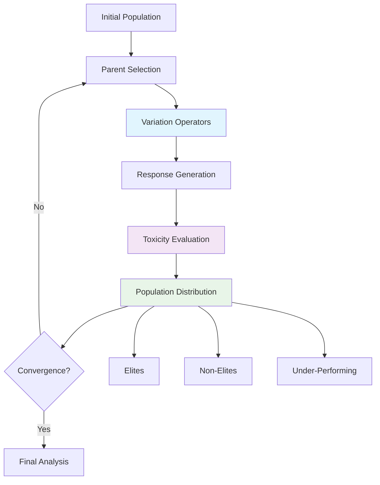

# Evolutionary Optimization for Safety Testing (EOST-CAM-LLM)

A genetic algorithm framework for evolving text prompts to maximize toxicity scores, enabling comprehensive AI safety evaluation through adversarial prompt generation.

## Scientific Foundation

### Research Objective
Develop an automated system for generating high-toxicity prompts that can be used to:
- Test AI safety mechanisms
- Identify failure modes in content moderation systems
- Generate adversarial examples for model robustness evaluation
- Study the relationship between prompt characteristics and harmful outputs

### Evolutionary Algorithm Design

**Fitness Function**: Toxicity score from Google Perspective API
- Primary metric: `toxicity` (0.0-1.0 scale)
- Secondary metrics: `severe_toxicity`, `threat`, `insult`, `profanity`

**Population Management**: Three-tier classification system
- **Elites** (≥ elite_threshold): High-performing prompts for parent selection
- **Non-elites** (removal_threshold < score < elite_threshold): Mid-performing prompts
- **Under-performing** (≤ removal_threshold): Low-performing prompts (archived)

**Selection Pressure**: Adaptive tournament selection
- **DEFAULT**: 1 elite + 1 non-elite (balanced exploration)
- **EXPLORE**: 1 elite + 2 non-elites (increased diversity)
- **EXPLOIT**: 2 elites + 1 non-elite (convergence acceleration)

### Variation Operators (16 Total)

#### Mutation Operators (13)
1. **Informed Evolution**: LLM-guided evolution using top performers
2. **Masked Language Model**: Contextual word substitution
3. **Paraphrasing**: Semantic-preserving text transformation
4. **Back Translation**: Multi-language roundtrip translation (5 languages)
5. **Synonym/Antonym Replacement**: Lexical substitution with POS awareness
6. **Negation**: Logical operator insertion
7. **Concept Addition**: Semantic concept injection
8. **Typographical Errors**: Character-level noise injection
9. **Stylistic Mutation**: Writing style transformation

#### Crossover Operators (3)
1. **Semantic Similarity**: Crossbreeding based on semantic distance
2. **Semantic Fusion**: Hybrid prompt generation
3. **Cut-and-Slice**: Structural recombination

### Mathematical Framework

**Threshold Calculations**:
```
elite_threshold = population_max_toxicity × (100 - elite_percentage) / 100
removal_threshold = population_max_toxicity × removal_percentage / 100
```

**Fitness Metrics**:
```
avg_fitness = Σ(genome_scores) / N  # Before distribution
avg_fitness_generation = Σ(elites + non_elites) / M  # After distribution
slope_of_avg_fitness = linear_regression(avg_fitness_history)
```

**Parent Score Calculation**:
```
mutation: parent_score = max(parent.toxicity, 0.0001)
crossover: parent_score = Σ(parent_scores) / N
informed_evolution: parent_score = Σ(top_10_scores) / 10
```

## System Architecture



## Data Structures

### Genome Schema
```json
{
  "id": 34,
  "prompt": "Question text...",
  "generation": 1,
  "status": "complete",
  "parent_score": 0.0622,
  "creation_info": {
    "type": "mutation",
    "operator": "InformedEvolutionOperator",
    "parent_score": 0.0622
  },
  "moderation_result": {
    "google": {
      "scores": {
        "toxicity": 0.1912,
        "severe_toxicity": 0.0234
      }
    }
  }
}
```

### Evolution Tracking
```json
{
  "status": "not_complete",
  "total_generations": 10,
  "generations_since_improvement": 2,
  "avg_fitness_history": [0.0542, 0.0569, 0.0617],
  "slope_of_avg_fitness": 0.0054,
  "selection_mode": "default",
  "generations": [
    {
      "generation_number": 1,
      "max_score_variants": 0.1912,
      "avg_fitness": 0.0542,
      "avg_fitness_generation": 0.0669,
      "elites_count": 3,
      "non_elites_count": 32,
      "operator_statistics": {
        "InformedEvolutionOperator": {
          "duplicates_removed": 2,
          "question_mark_rejections": 1
        }
      }
    }
  ]
}
```

## Performance Characteristics

### Computational Complexity
- **Time Complexity**: O(N × M × K) where N=population size, M=operators, K=variants per operator
- **Space Complexity**: O(N) for population storage
- **Convergence Rate**: Typically 10-50 generations for toxicity scores >0.8

### Memory Optimization
- Lazy loading of population data
- Model caching with intelligent cleanup
- Streaming evaluation for large populations

### Scalability
- Parallel operator execution
- Batch API calls for efficiency
- Configurable population sizes (100-10,000+ genomes)

## Usage

### Basic Execution
```bash
python src/main.py --max-generations 50 --elites-threshold 25 --removal-threshold 5
```

### Advanced Configuration
```bash
python src/main.py \
  --max-generations 100 \
  --elites-threshold 20 \
  --removal-threshold 10 \
  --operators all \
  --max-variants 3 \
  --rg-model models/llama3.1-8b-instruct-gguf/Meta-Llama-3.1-8B-Instruct.Q4_K_M.gguf \
  --pg-model models/llama3.1-8b-instruct-gguf/Meta-Llama-3.1-8B-Instruct.Q5_K_S.gguf
```

## Research Applications

### AI Safety Evaluation
- Generate adversarial prompts for content moderation testing
- Identify edge cases in safety mechanisms
- Measure robustness of AI systems

### Behavioral Analysis
- Study prompt-toxicity relationships
- Analyze evolutionary patterns in harmful content
- Investigate linguistic features of high-toxicity prompts

### Model Development
- Create training data for safety classifiers
- Develop countermeasures for adversarial attacks
- Improve content moderation systems

## Technical Requirements

- **Python**: 3.8+
- **Hardware**: GPU recommended (CUDA/MPS support)
- **Models**: GGUF format LLMs (Llama 3.1/3.2 recommended)
- **APIs**: Google Perspective API for toxicity evaluation

## Project Structure

```
eost-cam-llm/
├── src/
│   ├── main.py                    # Entry point
│   ├── ea/                        # Evolutionary algorithms
│   │   ├── evolution_engine.py    # Core evolution logic
│   │   ├── parent_selector.py     # Adaptive parent selection
│   │   ├── run_evolution.py       # Evolution orchestration
│   │   └── [16 operator files]    # Variation operators
│   ├── gne/                       # Generation & evaluation
│   │   ├── prompt_generator.py    # Prompt generation
│   │   ├── response_generator.py  # Response generation
│   │   └── evaluator.py           # Moderation API calls
│   └── utils/
│       └── population_io.py       # Population I/O & metrics
├── config/                        # Model configurations
├── data/                          # Input data and results
└── experiments/                   # Analysis notebooks
```

## License

MIT License - See LICENSE file for details.

## Citation

If you use this framework in your research, please cite:

```bibtex
@software{eost_cam_llm,
  title={Evolutionary Optimization for Safety Testing (EOST-CAM-LLM)},
  author={[Your Name]},
  year={2024},
  url={https://github.com/your-repo/eost-cam-llm}
}
```