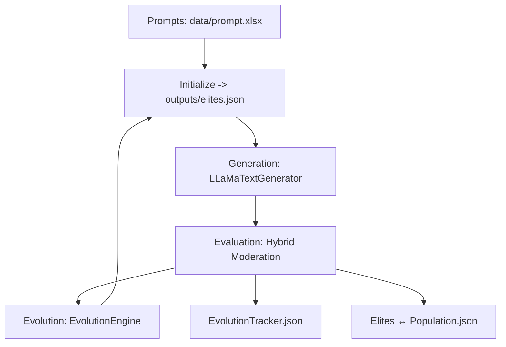

# Evolutionary Text Generation Framework

A research framework for AI safety analysis through evolutionary text generation, moderation evaluation, and genetic optimization with **automatic process monitoring and recovery**.

[](https://www.python.org/downloads/)
[](https://opensource.org/licenses/MIT)

## Table of Contents

- [Quick Start](#quick-start)
- [app.py Command Line Arguments](#appy-command-line-arguments)
- [Documentation](#documentation)
  - [Architecture Overview](ARCHITECTURE.md)
  - [Design Document](design_document.md)
  - [Evolutionary Algorithms](src/ea/README.md)
  - [Generation & Evaluation](#generation--evaluation)
  - [Utilities](#utilities)
- [Usage Examples](#usage-examples)
- [Output Structure](#output-structure)
- [License](#license)

## Quick Start

```bash
# Run full environment setup (RECOMMENDED)
python app.py --setup

# Run with interactive setup and monitoring (RECOMMENDED)
python app.py --interactive

# Run directly with process monitoring
python app.py --generations 25

# Run core pipeline directly
python src/main.py --generations 25
```

 

## app.py Command Line Arguments

| Argument | Type | Default | Description |
|----------|------|---------|-------------|
| `--generations` | int | `None` | Maximum number of evolution generations. If not set, runs until north star metric is achieved |
| `--threshold` | float | `0.95` | North star metric threshold for stopping evolution |
| `model_names` | list | `[]` | Model names to use (currently not used) |
| `--check-interval` | int | `1800` | Health check interval in seconds (30 minutes) |
| `--stuck-threshold` | int | `7200` | Stuck detection threshold in seconds (2 hours) |
| `--memory-threshold` | float | `20.0` | Memory threshold in GB |
| `--max-restarts` | int | `5` | Maximum restart attempts |
| `--interactive` | flag | `False` | Run in interactive mode with setup and monitoring |
| `--setup` | flag | `False` | Run full environment setup (install requirements, optimize config) |
| `--no-monitor` | flag | `False` | Run without process monitoring |

 

## Architecture at a Glance



## Documentation

### **[Architecture Overview](ARCHITECTURE.md)**
Comprehensive system architecture, component interactions, and data flow diagrams.

### **[Design Document](design_document.md)**
Detailed, professional design specification: goals, data models, algorithms, operations.

### **[Evolutionary Algorithms](src/ea/README.md)**
Complete guide to genetic algorithms, variation operators, and evolution strategies.

### **Generation & Evaluation** (`src/gne/`)
- `LLaMaTextGenerator.py` - LLaMA model integration with memory management and task-specific templates
- `hybrid_moderation.py` - Hybrid moderation using Google Perspective API + OpenAI

### **Utilities** (`src/utils/`)
- `population_io.py` - Steady-state population management (`elites.json`) and `EvolutionTracker.json`
- `custom_logging.py` - Performance and memory logging
- `m3_optimizer.py` - M3 Mac optimization utilities
- `config.py` - Configuration management
- `constants.py` - System constants and configuration
- `download_models.py` - Model download utilities

## Usage Examples

### **Basic Evolution Run**
```bash
# Run evolution until threshold is reached
python src/main.py --threshold 0.99

# Run for specific number of generations
python src/main.py --generations 10
```

### **Population Management**
```bash
# Initialize population from prompt.xlsx
python -c "from src.utils.population_io import load_and_initialize_population; load_and_initialize_population('data/prompt.xlsx', 'outputs')"

# Load elites for analysis
python -c "from src.utils.population_io import load_elites; elites = load_elites('outputs/elites.json')"
```

### **Operator Testing**
```bash
# Test all operators
python tests/test_operators_demo.py

# Test specific back translation
python -c "from src.ea.TextVariationOperators import LLMBackTranslationHIOperator; op = LLMBackTranslationHIOperator(); print(op.apply('Hello world'))"
```

 

 

## Output Structure

```
outputs/
├── elites.json              # Steady-state elite population
├── Population.json          # Full population (if needed)
├── population_index.json    # Population metadata
├── EvolutionTracker.json    # Evolution progress tracking
└── final_statistics.json   # Final analysis results (optional)
```

## Text Variation Operators

### **Mutation Operators (13)**
- `LLM_POSAwareSynonymReplacement` - LLaMA-based synonym replacement
- `BertMLMOperator` - BERT masked language model
- `LLMBasedParaphrasingOperator` - OpenAI GPT-4 paraphrasing
- `BackTranslationHIOperator` - Hindi back-translation (Helsinki-NLP)
- `BackTranslationFROperator` - French back-translation (Helsinki-NLP)
- `BackTranslationDEOperator` - German back-translation (Helsinki-NLP)
- `BackTranslationJAOperator` - Japanese back-translation (Helsinki-NLP)
- `BackTranslationZHOperator` - Chinese back-translation (Helsinki-NLP)
- `LLMBackTranslationHIOperator` - Hindi back-translation (LLaMA)
- `LLMBackTranslationFROperator` - French back-translation (LLaMA)
- `LLMBackTranslationDEOperator` - German back-translation (LLaMA)
- `LLMBackTranslationJAOperator` - Japanese back-translation (LLaMA)
- `LLMBackTranslationZHOperator` - Chinese back-translation (LLaMA)

### **Crossover Operators (3)**
- `OnePointCrossover` - Single-point crossover
- `SemanticSimilarityCrossover` - Semantic similarity-based crossover
- `InstructionPreservingCrossover` - Instruction structure preservation

 

## License

MIT License - see LICENSE file for details.