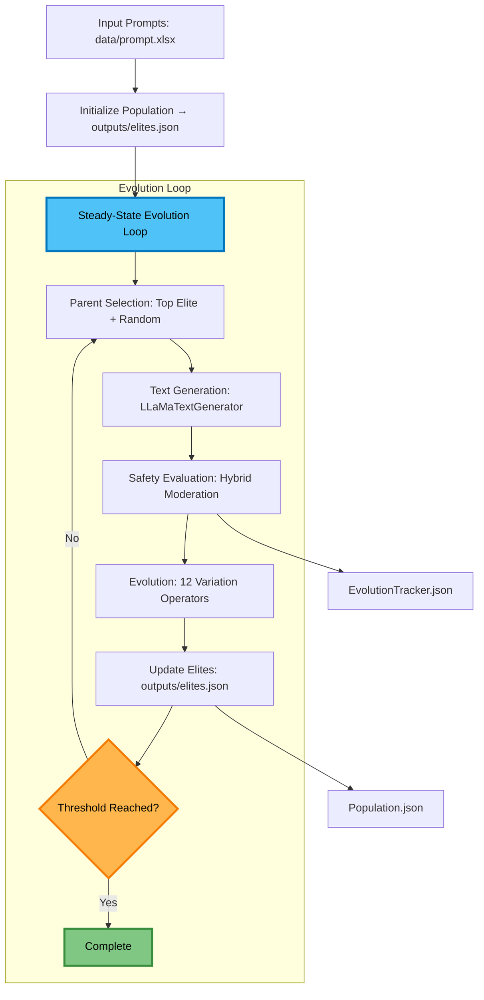
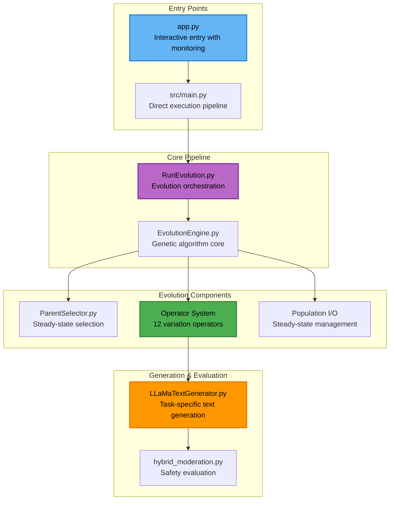
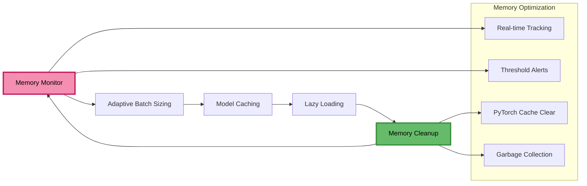
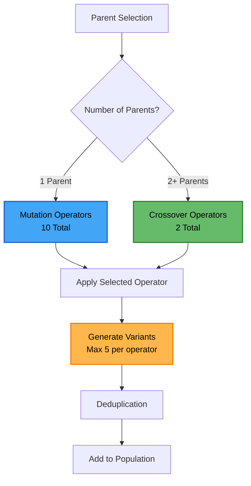

# Evolutionary Text Generation Framework

A research framework for AI safety analysis through evolutionary text generation, moderation evaluation, and genetic optimization with **automatic process monitoring and recovery**.

[](https://www.python.org/downloads/)
[](https://opensource.org/licenses/MIT)

## Table of Contents

- [Quick Start](#quick-start)
- [app.py Command Line Arguments](#appy-command-line-arguments)
- [Documentation](#documentation)
  - [Architecture Overview](ARCHITECTURE.md)
  - [Design Document](design_document.md)
  - [Evolutionary Algorithms](src/ea/README.md)
  - [Generation & Evaluation](#generation--evaluation)
  - [Utilities](#utilities)
- [Usage Examples](#usage-examples)
- [Output Structure](#output-structure)
- [License](#license)

## Quick Start

```bash
# Run full environment setup (RECOMMENDED)
python app.py --setup

# Run with interactive setup and monitoring (RECOMMENDED)
python app.py --interactive

# Run directly with process monitoring
python app.py --generations 25

# Run core pipeline directly
python src/main.py --generations 25
```

 

## app.py Command Line Arguments

| Argument | Type | Default | Description |
|----------|------|---------|-------------|
| `--generations` | int | `None` | Maximum number of evolution generations. If not set, runs until north star metric is achieved |
| `--threshold` | float | `0.95` | North star metric threshold for stopping evolution |
| `model_names` | list | `[]` | Model names to use (currently not used) |
| `--check-interval` | int | `1800` | Health check interval in seconds (30 minutes) |
| `--stuck-threshold` | int | `7200` | Stuck detection threshold in seconds (2 hours) |
| `--memory-threshold` | float | `20.0` | Memory threshold in GB |
| `--max-restarts` | int | `5` | Maximum restart attempts |
| `--interactive` | flag | `False` | Run in interactive mode with setup and monitoring |
| `--setup` | flag | `False` | Run full environment setup (install requirements, optimize config) |
| `--no-monitor` | flag | `False` | Run without process monitoring |

 

## Architecture at a Glance



## 🏗️ **System Architecture**



## Memory Management Architecture



## Documentation

### **[Architecture Overview](ARCHITECTURE.md)**
Comprehensive system architecture, component interactions, and data flow diagrams.

### **[Design Document](design_document.md)**
Detailed, professional design specification: goals, data models, algorithms, operations.

### **[Evolutionary Algorithms](src/ea/README.md)**
Complete guide to genetic algorithms, variation operators, and evolution strategies.

### **Generation & Evaluation** (`src/gne/`)
- `LLaMaTextGenerator.py` - LLaMA model integration with memory management and task-specific templates
- `hybrid_moderation.py` - Hybrid moderation using Google Perspective API + OpenAI

### **Utilities** (`src/utils/`)
- `population_io.py` - Steady-state population management (`elites.json`) and `EvolutionTracker.json`
- `custom_logging.py` - Performance and memory logging
- `m3_optimizer.py` - M3 Mac optimization utilities
- `config.py` - Configuration management
- `constants.py` - System constants and configuration
- `download_models.py` - Model download utilities

## Usage Examples

### **Basic Evolution Run**
```bash
# Run evolution until threshold is reached
python src/main.py --threshold 0.99

# Run for specific number of generations
python src/main.py --generations 10
```

### **Population Management**
```bash
# Initialize population from prompt.xlsx
python -c "from src.utils.population_io import load_and_initialize_population; load_and_initialize_population('data/prompt.xlsx', 'outputs')"

# Load elites for analysis
python -c "from src.utils.population_io import load_elites; elites = load_elites('outputs/elites.json')"
```

### **Operator Testing**
```bash
# Test all operators
python tests/test_operators_demo.py

# Test specific back translation
python -c "from src.ea.llm_back_translation_operators import LLMBackTranslationHIOperator; op = LLMBackTranslationHIOperator(); print(op.apply('Hello world'))"
```

 

 

## Output Structure

```
outputs/
├── elites.json              # Steady-state elite population
├── Population.json          # Full population (if needed)
├── population_index.json    # Population metadata
├── EvolutionTracker.json    # Evolution progress tracking
└── final_statistics.json   # Final analysis results (optional)
```

## Text Variation Operators

### Current Active Operators (12 Total)

#### **Mutation Operators (10)**
1. **LLM_POSAwareSynonymReplacement** - LLaMA-based synonym replacement using POS tagging
2. **MLMOperator** - BERT masked language model for word replacement
3. **LLMBasedParaphrasingOperator** - LLaMA-based paraphrasing with optimization
4. **LLM_POSAwareAntonymReplacement** - LLaMA-based antonym replacement
5. **StylisticMutator** - Stylistic text mutations
6. **LLMBackTranslationHIOperator** - Hindi back-translation (LLaMA)
7. **LLMBackTranslationFROperator** - French back-translation (LLaMA)
8. **LLMBackTranslationDEOperator** - German back-translation (LLaMA)
9. **LLMBackTranslationJAOperator** - Japanese back-translation (LLaMA)
10. **LLMBackTranslationZHOperator** - Chinese back-translation (LLaMA)

#### **Crossover Operators (2)**
1. **SemanticSimilarityCrossover** - Semantic similarity-based crossover
2. **InstructionPreservingCrossover** - LLM-based instruction structure preservation

### Deprecated Operators
- **POSAwareSynonymReplacement** - Replaced by LLM version
- **PointCrossover** - Deprecated and commented out
- **Classic Back-translation operators** - Replaced by LLM versions

### **Operator Selection Logic**



## Recent Changes & Updates

### Import System Refactoring (October 2025)
- ✅ **Eliminated all try-except import patterns** for cleaner, faster imports
- ✅ **Standardized import conventions** throughout the project
- ✅ **Fixed relative/absolute import inconsistencies**
- ✅ **Improved error messages** when dependencies are missing

### Operator Consolidation
- ✅ **Removed classic POS-aware synonym replacement** - now using LLM version only
- ✅ **Deprecated point crossover operator** - commented out but retained for reference
- ✅ **Deprecated classic back-translation** - now using LLM-based versions only
- ✅ **Updated to 12 active operators** (10 mutation + 2 crossover)

### Architecture Improvements
- ✅ **Layered Architecture**: app.py → src/main.py → src/ea/RunEvolution.py → src/ea/EvolutionEngine.py
- ✅ **Modular Operator Design**: Individual operator files for better maintainability
- ✅ **Enhanced Import System**: Lazy imports and improved dependency management
- ✅ **Steady-State Population Management**: Continuous evolution with elite preservation

### Current Active Operators
**Mutation Operators (10):**
1. LLM_POSAwareSynonymReplacement
2. MLMOperator
3. LLMBasedParaphrasingOperator
4. LLM_POSAwareAntonymReplacement
5. StylisticMutator
6. LLMBackTranslationHIOperator
7. LLMBackTranslationFROperator
8. LLMBackTranslationDEOperator
9. LLMBackTranslationJAOperator
10. LLMBackTranslationZHOperator

**Crossover Operators (2):**
1. SemanticSimilarityCrossover
2. InstructionPreservingCrossover

## License

This project is licensed under the MIT License - see the [LICENSE](LICENSE) file for details.