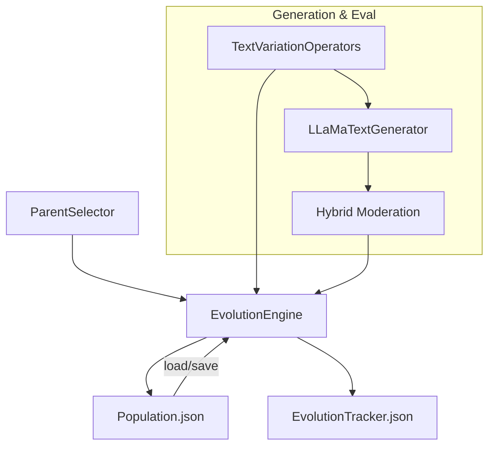

# EOST-CAM-LLM Design Document

## 1. Executive Summary

EOST-CAM-LLM is an evolutionary text generation and moderation framework. It iteratively generates prompt variants, evaluates them with a hybrid safety system, and evolves the population using genetic operators. The system emphasizes accuracy of evolution tracking, single-file population management, and memory-aware execution. This document details goals, architecture, data models, algorithms, and operational considerations to guide development, review, and maintenance.

## 2. Goals and Non‑Goals

- Goals
  - Provide a reproducible pipeline for evolutionary prompt optimization
  - Maintain a single authoritative `Population.json` with accurate lineage and status
  - Track per-generation best score post-evaluation with an `EvolutionTracker.json`
  - Support robust parent selection and genetic variation operators
  - Ensure memory- and performance-aware execution on local hardware
  - Offer observable, debuggable runs with structured logs and metrics
- Non-Goals
  - Building a full web UI (CLI/Script-centric)
  - Serving real-time inference as an API
  - Providing a turnkey MLOps platform (logs and outputs focus on local artifacts)

## 3. System Context

```mermaid
flowchart LR
  A[Input Prompts (Excel)] --> B[Population Initialization]
  B --> C[Text Generation]
  C --> D[Hybrid Moderation]
  D --> E[Evolution Engine]
  E -->|Variants| B
  E --> F[Trackers & Outputs]
  B -->|Population.json| F
```

- Users operate the system via scripts in `app.py` and `src/main.py`.
- External services: LLM providers (LLaMA local/inference), Safety APIs (Google, OpenAI). 
- Artifacts are stored under `outputs/YYYY-MM-DD/` per run.

## 4. Requirements

- Functional
  - Initialize a population of genomes from an Excel file (unique prompts)
  - Generate text variants via mutation and crossover operators
  - Evaluate candidate prompts via hybrid moderation (Google + OpenAI)
  - Select parents based on a configurable North Star metric
  - Persist population and trackers, with accurate per-generation best score
  - Deduplicate variants by normalized prompt text
- Non-Functional
  - Performance: Avoid loading unnecessary data; cap variants per operator; dedup
  - Memory: Prefer single-file population; lazy imports and targeted loading
  - Observability: Structured logs with timings (PerformanceLogger); breakdowns by status
  - Reproducibility: Date-based output directories; deterministic sorting of populations

## 5. High‑Level Architecture

- Entry Points
  - `app.py`: Orchestration, CLI-like utilities for end-to-end runs
  - `src/main.py`: Core pipeline runner (generations, evaluation, evolution)
- Core Modules
  - `src/ea/EvolutionEngine.py`: Genetic algorithm core (global evolution)
  - `src/ea/ParentSelector.py`: Parent selection strategies (size-based, tournament, roulette)
  - `src/ea/TextVariationOperators.py`: Mutation and crossover operators
  - `src/gne/LLaMaTextGenerator.py`: Text generation integration (memory-optimized)
  - `src/gne/hybrid_moderation.py`: Safety evaluation across providers
  - `src/utils/population_io.py`: Single-file population I/O, validation, sorting
  - `src/utils/custom_logging.py`: Logging and performance instrumentation



## 6. Data Model

- Genome (Population entry)
  - `id: str` (monotonic stringified integer)
  - `prompt: str`
  - `model_provider: Optional[str]`
  - `model_name: Optional[str]`
  - `moderation_result: Optional[dict]`
    - Possibly nested under `moderation_results.google.scores` and `moderation_results.openai.scores`
  - `operator: Optional[str]` (creator operator name)
  - `parents: List[str]` (ids)
  - `generation: int`
  - `status: str` (e.g., `pending_generation`, `pending_evaluation`, `complete`)
  - `creation_info: dict`
    - `type: mutation|crossover|initial`
    - `operator: str`
    - `source_generation: int`
    - `evolution_cycle: int`
- EvolutionTracker (Per-run, date-scoped directory)
  - Flat list of generation summaries (global scope)
  - For each generation: `generation_number`, `genome_id` (best), `max_score`, counts

## 7. Core Algorithms

- Parent Selection (`src/ea/ParentSelector.py`)
  - Size-based: single genome; small (2–4): top 3 crossover; large (5+): top 3
  - Tournament: sample k, pick best for mutation; random for crossover
  - Roulette: fitness-proportional selection (with floors to avoid zero)
  - Fitness extraction prioritizes Google >> OpenAI >> direct scores
- Variation Operators (`src/ea/TextVariationOperators.py`)
  - Mutation: multiple operators (e.g., BERT MLM, paraphrasing, back-translation)
  - Crossover: one-point, semantic similarity, instruction-preserving
  - Operators are lazily loaded; variant caps reduce growth
- Evolution Engine (`src/ea/EvolutionEngine.py`)
  - Global evolution on in-memory population
  - Uses current evolution cycle as `generation` for children
  - Deduplication: case-insensitive prompt text across offspring
  - Tracks `variants_created`, `mutation_variants`, `crossover_variants`

## 8. Control Flow

1) Initialization
   - Load prompts from `data/prompt.xlsx` (or configured source)
   - Create `Population.json` (gen 0), initialize `EvolutionTracker.json`
2) Generate & Evaluate
   - Generate variants for selected parents
   - Evaluate with hybrid moderation, persist scores
3) Evolve
   - Update best-of-generation (children’s evaluated scores)
   - Deduplicate, update population file
4) Repeat for configured generations/cycles

## 9. Configuration

- `config/modelConfig.yaml`: Model, generation, and moderation settings
- CLI/Runner Parameters
  - `north_star_metric`: Primary fitness key (e.g., toxicity inversions, helpfulness)
  - `generations/cycles`: Number of evolution iterations
  - `threshold`: Early-stopping when score achieved

## 10. Persistence & File Layout

- Outputs root: `outputs/YYYY-MM-DD/`
  - `Population.json`: Single authoritative population store
  - `EvolutionTracker.json`: Generation summaries (flat list)
  - `population_index.json`: Derived metadata for convenience
- Sorting: generation asc, id asc (unless preserving custom order)
- Deduplication: normalized prompt text uniqueness for gen > 0

## 11. Observability

- `utils/custom_logging.py`
  - `PerformanceLogger` scoped timers with contextual metadata
  - Module-scoped loggers per component
- Key Log Points
  - Population load/save counts and sizes
  - Selection decisions and operator usage
  - Evaluation outcomes and best scores
  - Deduplication stats

## 12. Error Handling & Recovery

- Defensive reading/writing of JSON with clear error logs
- Fallbacks between single-file and split-file logic when applicable
- Validation utilities (`validate_population_file`) for schema sanity
- Safe handling when external APIs fail (zero scores, retries external to core)

## 13. Performance & Scalability

- Single-file `Population.json` for a consistent, low-friction workflow
- Lazy imports to avoid heavy dependencies until needed
- Option to load subsets: by generation, by range, or lazily iterate
- Variant caps and dedup prevent uncontrolled population growth

## 14. Security & Privacy

- API keys for external services must be provided via environment variables or secure config
- Avoid logging sensitive content; truncate prompts where necessary
- Treat moderation outputs as sensitive if they could contain user content

## 15. Testing Strategy

- Unit Tests
  - `population_io`: load/save/sort/dedup/validation
  - `ParentSelector`: deterministic selection given fixed inputs
  - Operators: shape and bounds of outputs
- Integration Tests
  - End-to-end small run: initialization → generation → evaluation → evolution
  - Tracker validation: correct max score per generation (children, not parents)
- Contract Tests
  - Genome schema, tracker schema for backward compatibility

## 16. Deployment & Runbook

- Environment
  - Python 3.12; see `requirements.txt`
  - Optional GPU acceleration (transformers/torch if used)
- Typical Run
  - Initialize population from Excel
  - Execute `src/main.py` with desired `--generations` and metric
- Artifacts
  - Inspect `outputs/<date>/Population.json` and `EvolutionTracker.json`
  - Review logs under `logs/`

## 17. Backward Compatibility & Migration

- Single-file population is the default
- Migration helpers (in `population_io.py`)
  - `consolidate_generations_to_single_file(...)`
  - `migrate_from_split_to_single(...)`
- Sorting preserves generation/id order unless explicit custom order requested

## 18. Risks & Mitigations

- Risk: Variant explosion and memory pressure
  - Mitigation: Cap variants/operator, deduplication, lazy operations
- Risk: Stagnation/premature convergence
  - Mitigation: Multiple selection strategies; diversify crossover parents
- Risk: External API failures
  - Mitigation: Fallback scoring, retries outside core, logging and skip logic
- Risk: Data integrity (corruption)
  - Mitigation: Sorting, validation utilities, atomic saves where practical

## 19. Future Work

- Steady-state evolution mode with continuous replacement and elite preservation
- Adaptive selection pressure and diversity-aware parent selection
- Multi-objective optimization (Pareto fronts)
- Distributed/parallel evaluation orchestration
- Rich analytics dashboards and result visualization

## 20. Glossary

- Genome: An individual prompt and its metadata within the population
- Generation: Evolution iteration tag used for tracking and analysis
- Evolution Cycle: Logical step increment for offspring `generation` in the engine
- North Star Metric: Primary scalar used for parent selection and fitness ranking

## 21. Key Files Index

- Pipeline
  - `app.py`: High-level orchestration and utilities
  - `src/main.py`: Main evolution pipeline entry point
- Evolutionary Algorithms (EA)
  - `src/ea/EvolutionEngine.py`: Core evolution loop and offspring creation
  - `src/ea/ParentSelector.py`: Parent selection strategies
  - `src/ea/TextVariationOperators.py`: Mutation and crossover operators
  - `src/ea/RunEvolution.py`: Execution, tracker updates, persistence
- Generation & Evaluation (GNE)
  - `src/gne/LLaMaTextGenerator.py`: Text generation
  - `src/gne/hybrid_moderation.py`: Hybrid moderation scoring
- Utilities
  - `src/utils/population_io.py`: I/O, sorting, validation, migration
  - `src/utils/custom_logging.py`: Logging utilities and performance timers
  - `src/utils/config.py`, `src/utils/m3_optimizer.py`: Configuration and platform tweaks

---

This design document should be updated alongside architectural changes to keep the system understandable and maintainable. Please link any material changes to the corresponding section(s) here during reviews.
