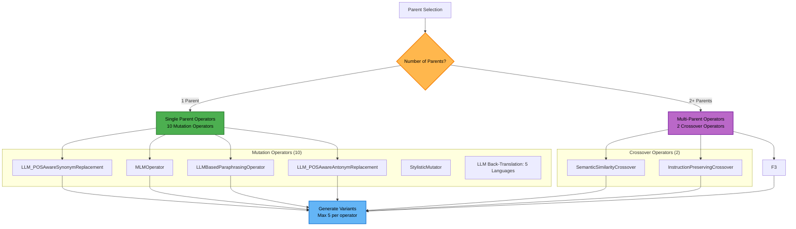
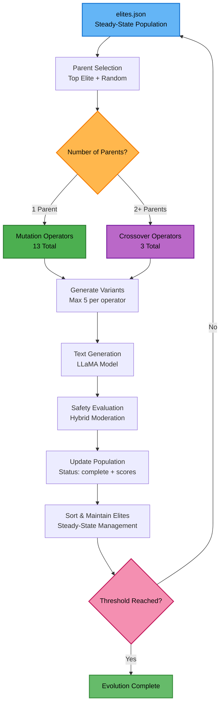

# Evolutionary Algorithms (EA) Package

The Evolutionary Algorithms package provides the core genetic algorithm functionality for evolving text prompts through mutation and crossover operations. This package implements a complete evolutionary framework with parent selection, variation operators, and steady-state population management.

## 🧬 **Core Components**

### **1. EvolutionEngine** (`EvolutionEngine.py`)
The main orchestrator for the evolutionary process.

**Key Features:**
- Manages genome populations and evolution cycles (steady-state evolution)
- Coordinates parent selection and variant generation
- Tracks variant counts and integrates deduplication
- Steady-state population persistence (`outputs/elites.json`)
- Memory-optimized for large populations
- Supports 12 text variation operators

**Main Methods (excerpt):**
```python
# Initialize evolution engine
engine = EvolutionEngine(north_star_metric, log_file, current_cycle)

# Generate variants globally for the current cycle
generation_data = engine.generate_variants_global()

# Keep IDs consistent with current population
engine.update_next_id()
```

### **2. RunEvolution** (`RunEvolution.py`)
The main evolution pipeline driver and execution coordinator.

**Key Features:**
- Orchestrates complete evolution cycles
- Manages evolution tracker and metadata
- Handles threshold checking and completion logic
- Provides statistics and reporting
- Enhanced `max_score` calculation per generation
- Steady-state population loading and in-memory filtering

**Main Functions:**
```python
# Run complete evolution cycle
run_evolution(north_star_metric, log_file, threshold=0.95, current_cycle=None)

# Check threshold achievement
check_threshold_and_update_tracker(population, north_star_metric, logger, threshold=0.95)

# Update evolution tracker with generation data
update_evolution_tracker_with_generation_global(generation_data, evolution_tracker, logger, population, north_star_metric)
```

**Recent Fixes:**
- Accurate `max_score` per generation (children, not parent)
- Steady-state population I/O
- Lazy imports and efficient data loading

### **3. ParentSelector** (`ParentSelector.py`)
Intelligent parent selection strategies for genetic operations.

**Selection Strategies:**
- **Steady-State Selection**: Topmost elite + random elites + random population
- Single Genome
- Small Population (2–4)
- Large Population (5+)
- Tournament Selection
- Roulette Selection

**Steady-State Strategy:**
```python
def select_parents_steady_state(self):
    # Mutation parent: Topmost elite
    # Crossover parents: Topmost + 1 random elite + 3 random population
    # Up to 5 crossover parents for maximum diversity
```

### **4. Individual Operator Files**
Comprehensive implementation of mutation and crossover operators as separate modules.

**Recent Improvements:**
- **12 Total Operators**: 10 mutation + 2 crossover (consolidated and cleaned up)
- **Multi-Language Support**: 5 languages (Hindi, French, German, Japanese, Chinese)
- **LLM-Only Back-Translation**: Moved to LLaMA-based translation only
- **Deprecated Legacy Operators**: Removed classic POS-aware and point crossover
- **Standardized Imports**: Eliminated try-except import patterns
- Lazy Initialization
- Memory Management
- Error Handling
- Variant cap tuned to reduce growth

## 🔄 **Variation Operators**

### **Mutation Operators (10)**

#### **Core LLM Operators**
- **`LLM_POSAwareSynonymReplacement`**: LLaMA-based synonym replacement using POS tagging (classic POS-aware operator deprecated)
  - Uses spaCy for POS analysis
  - LLaMA for intelligent synonym selection
  - Context-aware replacements

#### **BERT-Based Operators**
- **`MLMOperator`**: Masked language model operator for word replacement
  - Uses `bert-base-uncased` model
  - Masked language modeling for word prediction
  - Contextual word replacements

#### **OpenAI-Based Operators**
- **`LLMBasedParaphrasingOperator`**: OpenAI GPT-4 based paraphrasing with optimization
  - Uses OpenAI GPT-4 API
  - Optimized for paraphrasing tasks
  - High-quality text variations

#### **Model-Based Back-Translation Operators (5)**
- **`BackTranslationHIOperator`**: Hindi back-translation (Helsinki-NLP)
- **`BackTranslationFROperator`**: French back-translation (Helsinki-NLP)
- **`BackTranslationDEOperator`**: German back-translation (Helsinki-NLP)
- **`BackTranslationJAOperator`**: Japanese back-translation (Helsinki-NLP)
- **`BackTranslationZHOperator`**: Chinese back-translation (Helsinki-NLP)

#### **LLM-Based Back-Translation Operators (5)**
- **`LLMBackTranslationHIOperator`**: Hindi back-translation (LLaMA)
- **`LLMBackTranslationFROperator`**: French back-translation (LLaMA)
- **`LLMBackTranslationDEOperator`**: German back-translation (LLaMA)
- **`LLMBackTranslationJAOperator`**: Japanese back-translation (LLaMA)
- **`LLMBackTranslationZHOperator`**: Chinese back-translation (LLaMA)

### **Crossover Operators (2)**

#### **Semantic Crossover**
- **`SemanticSimilarityCrossover`**: Crossover based on semantic similarity
  - Uses sentence transformers for embeddings
  - Semantic similarity threshold
  - Meaning-preserving combinations

#### **Instruction-Aware Crossover**
- **`InstructionPreservingCrossover`**: Crossover that preserves instruction structure
  - Uses config-driven prompt templates
  - Preserves command/question structure
  - Optimizes for north star metric
  - Returns single variant per call

### **Deprecated Operators**

#### **Removed from Active Use**
- **`POSAwareSynonymReplacement`**: Classic BERT-based POS synonym replacement (replaced by LLM version)
- **`PointCrossover`**: Single-point sentence crossover (deprecated and commented out)
- **`BackTranslation*Operators`**: Helsinki-NLP based back-translation (replaced by LLM versions)

> **Note**: Deprecated operators are retained in codebase for reference but are not loaded or used in evolution.

## 📊 **Operator Selection Logic**



```python
def get_applicable_operators(num_parents: int, north_star_metric, log_file=None):
    if num_parents == 1:
        return get_single_parent_operators(north_star_metric, log_file)  # 10 mutation operators
    return get_multi_parent_operators(log_file)  # 2 crossover operators
```

## 🔧 **Configuration**

```python
# Maximum variants per operator (tuned)
max_variants = 5  # Reduced from 10 to control growth

# Back-translation configuration
target_languages = ['Hindi', 'French', 'German', 'Japanese', 'Chinese']
translation_methods = ['model_based', 'llm_based']  # Dual approaches
```

## 📈 **Evolution Flow**

1) **Population Initialization** → `elites.json`
2) **Parent Selection** → Steady-state selection from elites
3) **Variant Generation** → 16 operators, capped variants, deduplicated
4) **Tracker Update** → Per-generation best score, counts, parent information

### Steady-State Evolution Loop



## 🌍 **Multi-Language Support**

```mermaid
graph TB
  subgraph "Multi-Language Back-Translation Support"
    A[Input Text<br/>English]
    
    subgraph "Supported Languages (5)"
      B1[Hindi (HI)<br/>Devanagari script support]
      B2[French (FR)<br/>Romance language variations]
      B3[German (DE)<br/>Germanic language structure]
      B4[Japanese (JA)<br/>Complex script handling]
      B5[Chinese (ZH)<br/>Character-based translation]
    end
    
    subgraph "Translation Approaches (2)"
      C1[Model-Based<br/>Helsinki-NLP]
      C2[LLM-Based<br/>LLaMA]
    end
    
    subgraph "Translation Process"
      D1[English → Target Language]
      D2[Target Language → English]
      D3[Varied Output]
    end
    
    A --> B1
    A --> B2
    A --> B3
    A --> B4
    A --> B5
    
    B1 --> C1
    B1 --> C2
    B2 --> C1
    B2 --> C2
    B3 --> C1
    B3 --> C2
    B4 --> C1
    B4 --> C2
    B5 --> C1
    B5 --> C2
    
    C1 --> D1
    C2 --> D1
    D1 --> D2
    D2 --> D3
  end
  
  style A fill:#64b5f6,stroke:#1976d2,stroke-width:2px,color:#000
  style C1 fill:#4caf50,stroke:#2e7d32,stroke-width:2px,color:#000
  style C2 fill:#ba68c8,stroke:#7b1fa2,stroke-width:2px,color:#000
  style D3 fill:#ff9800,stroke:#ef6c00,stroke-width:2px,color:#000
```

### **Translation Approaches**
1. **Model-Based**: Helsinki-NLP translation models
   - Specialized translation models
   - Fast and efficient
   - Reliable for common language pairs

2. **LLM-Based**: LLaMA model translation
   - Context-aware translation
   - Better handling of complex sentences
   - More natural output

## 📁 **File Structure**

```mermaid
graph TB
  subgraph "src/ea/ Package Structure"
    A[__init__.py<br/>Package exports and lazy imports]
    B[EvolutionEngine.py<br/>Genetic algorithm core (steady-state)]
    C[RunEvolution.py<br/>Evolution pipeline driver]
    D[ParentSelector.py<br/>Selection strategies (steady-state)]
    E[Individual Operator Files<br/>12 variation operators]
    F[VariationOperators.py<br/>Legacy operators (deprecated)]
    G[operator_helpers.py<br/>Operator factory and utilities]
    H[README.md<br/>Package documentation]
  end
  
  subgraph "Individual Operator Files"
    E1[llm_pos_aware_synonym_replacement.py<br/>POS-aware synonym replacement]
    E2[mlm_operator.py<br/>Masked language modeling]
    E3[paraphrasing_operator.py<br/>OpenAI paraphrasing]
    E4[llm_pos_aware_antonym_replacement.py<br/>POS-aware antonym replacement]
    E5[stylistic_mutator.py<br/>Style variation]
    E6[llm_back_translation_operators.py<br/>Multi-language back-translation]
    E7[semantic_similarity_crossover.py<br/>Semantic similarity crossover]
    E8[instruction_preserving_crossover.py<br/>Instruction-preserving crossover]
  end
  
  subgraph "Key Dependencies"
    I[utils.population_io<br/>Steady-state population management]
    J[gne.LLaMaTextGenerator<br/>Text generation]
    K[gne.hybrid_moderation<br/>Safety evaluation]
    L[utils.custom_logging<br/>Performance tracking]
  end
  
  B --> I
  B --> J
  B --> K
  B --> L
  C --> B
  C --> D
  C --> E
  D --> I
  E --> J
  
  style A fill:#64b5f6,stroke:#1976d2,stroke-width:2px,color:#000
  style B fill:#ba68c8,stroke:#7b1fa2,stroke-width:2px,color:#000
  style C fill:#4caf50,stroke:#2e7d32,stroke-width:2px,color:#000
  style D fill:#ff9800,stroke:#ef6c00,stroke-width:2px,color:#000
  style E fill:#f48fb1,stroke:#c2185b,stroke-width:2px,color:#000
  style F fill:#bdbdbd,stroke:#616161,stroke-width:2px,color:#000
```

## 🔗 **Dependencies**
- torch, transformers, spacy, nltk, openai
- sentence-transformers (for semantic crossover)
- huggingface-hub (for model downloads)
- utils.custom_logging, utils.population_io, gne.LLaMaTextGenerator

## 📝 **Recent Updates and Fixes**

### **Major Additions**
- **12 Text Variation Operators**: Complete operator suite
- **Multi-Language Back-Translation**: 5 languages with dual approaches
- **Steady-State Population Management**: Elite preservation and continuous evolution
- **Task-Specific Templates**: Configurable prompts for different tasks
- **Enhanced Memory Management**: Model caching and lazy loading

### **Performance Improvements**
- `max_score` correctness per generation
- Steady-state population with indexing
- Lazy imports; robust path handling
- Model reuse across operators

### **Architecture Enhancements**
- Modular operator implementation (individual files vs monolithic class)
- Enhanced parent selection strategies
- Improved error handling and recovery
- Layered architecture: main.py → RunEvolution.py → EvolutionEngine.py

## 🚀 **Usage Examples**

### **Basic Operator Usage**
```python
from src.ea.llm_back_translation_operators import LLMBackTranslationHIOperator

# Initialize operator
operator = LLMBackTranslationHIOperator()

# Apply to text
variants = operator.apply("Hello world")
print(variants)  # ['नमस्ते दुनिया'] (Hindi translation)
```

### **Evolution Engine Usage**
```python
from src.ea.EvolutionEngine import EvolutionEngine

# Initialize engine
engine = EvolutionEngine("toxicity", log_file, current_cycle=1)

# Generate variants
generation_data = engine.generate_variants_global()
print(f"Created {generation_data['variants_created']} variants")
```

### **Parent Selection**
```python
from src.ea.ParentSelector import ParentSelector

# Initialize selector
selector = ParentSelector("toxicity", log_file)

# Select parents using steady-state strategy
mutation_parent, crossover_parents = selector.select_parents_steady_state()
```

This comprehensive EA package provides a robust foundation for evolutionary text generation with extensive operator support, multi-language capabilities, and efficient steady-state population management.