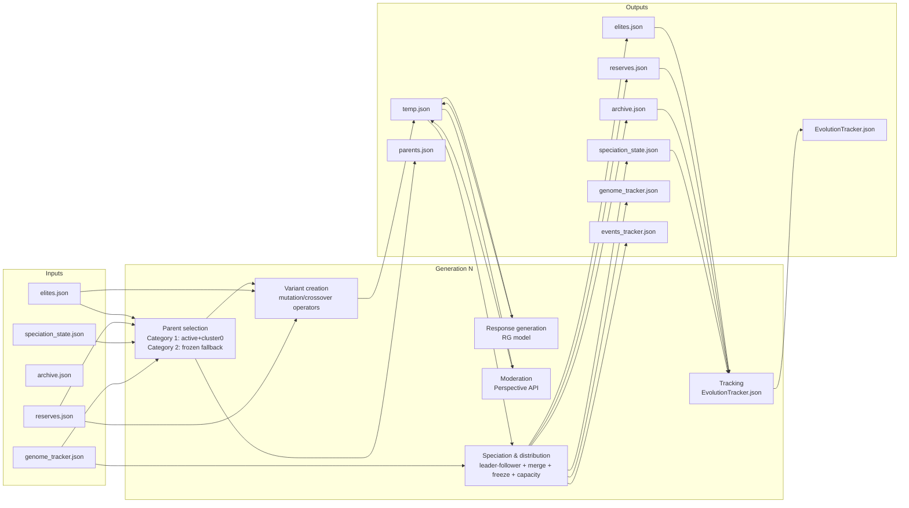

# System Diagram (End-to-End)

This document provides an end-to-end, **system-level** view of how this project runs: from `run_experiments_local.sh` → `src/main.py` → generation loop → evolution operators → moderation → speciation → persisted artifacts.

---

## End-to-end flow (one diagram)

```mermaid
flowchart TD
  %% ===== Entry points =====
  U[User] --> R[run_experiments_local.sh\n(sequential experiment runner)]
  R -->|python src/main.py ...| M[src/main.py\nmain()]

  %% ===== Config & environment =====
  ENV[.env\nPERSPECTIVE_API_KEY] --> M
  CFG[config/*.yaml\nRGConfig.yaml / PGConfig.yaml] --> M
  SEED[data/prompt.csv\nseed prompts] --> M
  MODELS[models/**/*.gguf\nRG + PG models] --> M

  %% ===== Initialization =====
  M --> INIT[initialize_system(...)\n(utils.get_system_utils)]
  INIT -->|constructs| RG[ResponseGenerator\n(src/gne/response_generator.py)]
  INIT -->|constructs| PG[PromptGenerator\n(src/gne/prompt_generator.py)]
  INIT --> OUT[Create output dir\n(data/outputs/YYYYMMDD_HHMM)]

  %% ===== Artifact store =====
  subgraph FS[Output directory: data/outputs/<run_id>/]
    T[temp.json\nworking set\npending_generation/pending_evaluation]
    E[elites.json\nspecies_id > 0]
    Z[reserves.json\nspecies_id = 0 (cluster0)]
    A[archive.json\nspecies_id = -1]
    GT[genome_tracker.json\nAUTHORITATIVE species_id + lineage]
    ES[EvolutionTracker.json\nrun-level metrics]
    SS[speciation_state.json\nspecies + cluster0 state]
    EV[events_tracker.json\n(speciation/merge/etc events)]
    PARENTS[parents.json\nparents selected this gen]
  end

  %% ===== Generation 0 =====
  M --> G0[Generation 0 bootstrap]
  G0 -->|write pending_generation| T
  G0 -->|for each pending genome| RG
  RG -->|LLM inference via llama.cpp| RGLLM[(RG GGUF model)]
  RG -->|writes generated_output + pending_evaluation| T

  %% ===== Moderation / evaluation =====
  M --> MOD[Moderation step\n(src/gne/evaluator.py)]
  MOD -->|reads pending_evaluation| T
  MOD -->|Perspective API calls| GP[(Google Perspective API)]
  MOD -->|writes moderation_result + complete| T
  MOD -->|refusal detection/penalty| REF[Refusal detector/penalty\n(src/utils/refusal_*.py)]

  %% ===== Speciation & distribution =====
  M --> SPEC[Speciation\n(src/speciation/run_speciation.py)]
  SPEC -->|sync genomes by tracker| GT
  SPEC -->|Phase: distribute| E
  SPEC -->|Phase: distribute| Z
  SPEC -->|Phase: archive overflow| A
  SPEC -->|save state| SS
  SPEC -->|save events| EV

  %% ===== Evolution loop (steady-state μ+λ) =====
  M --> LOOP[Generation loop\n(steady-state μ+λ)]
  LOOP --> SELECT[Parent selection\n(src/ea/parent_selector.py)]
  SELECT -->|writes| PARENTS
  SELECT -->|reads species groupings| SS
  SELECT -->|reads current pop| E
  SELECT -->|reads reserves| Z

  LOOP --> VAR[Generate variants\n(src/ea/run_evolution.py + operators)]
  VAR --> OPS[Variation operators\n(src/ea/*_operator.py)]
  OPS -->|mut/cross prompts| T
  VAR -->|deduplicate vs elites/reserves| E
  VAR -->|deduplicate vs elites/reserves| Z

  %% Variant evaluation
  LOOP -->|responses| RG
  LOOP -->|moderation| MOD
  LOOP -->|speciation| SPEC

  %% ===== Tracking & stopping =====
  M --> METRICS[Statistics & tracking\n(src/utils/population_io.py)]
  METRICS --> ES
  SPEC --> METRICS
  MOD --> METRICS
  VAR --> METRICS

  METRICS --> STOP{Stop?\nthreshold or max generations}
  STOP -->|no| LOOP
  STOP -->|yes| DONE[Final reports / summary]

  %% ===== Notes =====
  classDef store fill:#f6f6f6,stroke:#bbb,color:#111;
  class T,E,Z,A,GT,ES,SS,EV,PARENTS store;
```

---

## Per-generation pipeline (what reads/writes what)



---

## Why species sometimes “change IDs”

This matters because it can look like “a frozen species was saved under a new ID”.

- **Freeze** (stagnation-based): the species **keeps the same `species_id`** and only `species_state` changes to `"frozen"` in `speciation_state.json`.
- **Merge**: when two species merge, a **new species is created with a new ID**, and **both parent species become `"extinct"`** (tracked in the output state). This is intentional for clarity and lineage.
- **Incubation / dissolve to cluster0**: members move to **`species_id = 0`** (reserves). If new species form later from cluster0, they will naturally get **new IDs**.

---

## Key components (implementation mapping)

- **Experiment runner**: `run_experiments_local.sh`
- **Orchestration / main loop**: `src/main.py`
- **Response generation (RG model)**: `src/gne/response_generator.py`
- **Moderation / toxicity evaluation**: `src/gne/evaluator.py` (Google Perspective API)
- **Evolution / variant creation**: `src/ea/run_evolution.py` + operators in `src/ea/*.py`
- **Parent selection**: `src/ea/parent_selector.py`
- **Speciation & distribution**: `src/speciation/run_speciation.py`
  - leader-follower clustering: `src/speciation/leader_follower.py`
  - merging: `src/speciation/merging.py`
  - freezing / incubation rules: `src/speciation/run_speciation.py` + `src/speciation/extinction.py`
  - authoritative tracker: `src/speciation/genome_tracker.py`

---

## Output artifacts (what they mean)

- **`temp.json`**: work queue for genomes in-flight (`pending_generation` → `pending_evaluation` → `complete/error`).
- **`elites.json`**: genomes assigned to real species (`species_id > 0`).
- **`reserves.json`**: cluster0 (`species_id = 0`) outliers / reserves.
- **`archive.json`**: overflow / removed due to capacity (`species_id = -1`).
- **`genome_tracker.json`**: **authoritative** source of truth for `species_id` assignments and lineage.
- **`speciation_state.json`**: species metadata (leader, member IDs, stagnation, states) and cluster0 state.
- **`EvolutionTracker.json`**: run-level metrics (best scores, per-generation stats, diversity, etc.).
- **`parents.json`**: parents picked for the current generation (used for stagnation increments).
- **`events_tracker.json`**: speciation/merge/etc events (useful for debugging state transitions).

